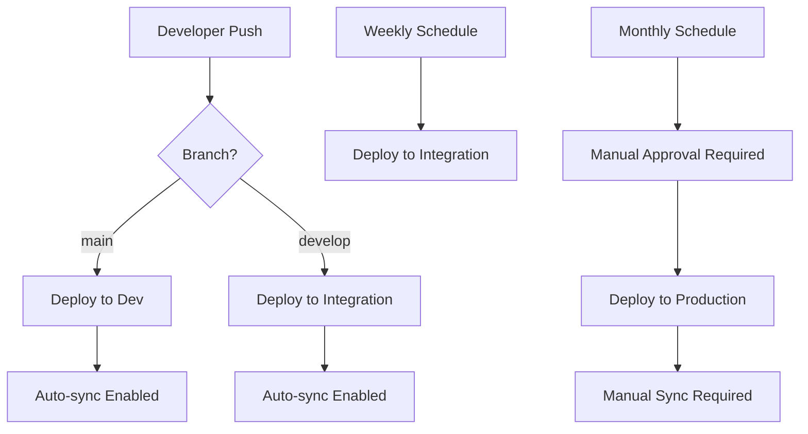

# 🚀 ATS Environment Deployment Strategy

## 📋 **Three-Tier Environment Overview**

Our ATS platform now uses a comprehensive three-tier deployment strategy with different update frequencies for each environment:

| Environment | Purpose | Update Frequency | Branch | Auto-Sync | Manual Approval |
|-------------|---------|------------------|--------|-----------|-----------------|
| **Dev** | Development & Testing | Continuous | `main` | ✅ Yes | ❌ No |
| **Integration** | Weekly Testing & QA | Weekly | `develop` | ✅ Yes | ❌ No |
| **Production** | Live System | Monthly | `main` | ❌ No | ✅ Yes |

---

## 🎯 **Environment Details**

### 🔧 **Development Environment (`ats-dev`)**
- **Purpose**: Rapid development and immediate testing
- **Update Frequency**: **Continuous** (every push to `main` branch)
- **Target Users**: Developers, immediate feature testing
- **Characteristics**:
  - Auto-sync enabled for immediate deployments
  - Self-healing enabled for automatic recovery
  - Pruning enabled for clean deployments
  - Connected to `main` branch for latest stable features

### 🧪 **Integration Environment (`ats-intg`)**
- **Purpose**: Weekly integration testing and QA validation
- **Update Frequency**: **Weekly** (Mondays at 9:00 AM UTC)
- **Target Users**: QA team, integration testing, stakeholder demos
- **Characteristics**:
  - Scheduled deployment via GitHub Actions cron job
  - Auto-sync enabled for reliable weekly updates
  - Connected to `develop` branch for feature integration
  - Comprehensive testing environment with production-like data

### 🏭 **Production Environment (`ats-prod`)**
- **Purpose**: Live production system for end users
- **Update Frequency**: **Monthly** (First Monday of month at 10:00 AM UTC)
- **Target Users**: End users, production workloads
- **Characteristics**:
  - Manual sync required for maximum control
  - No auto-healing to prevent unexpected changes
  - Connected to `main` branch for stable releases
  - Requires manual approval for all deployments

---

## ⏰ **Deployment Schedule**

### **Automated Deployments**
```yaml
# Weekly Integration Deployment
- cron: '0 9 * * 1'  # Every Monday at 9:00 AM UTC

# Monthly Production Deployment  
- cron: '0 10 1-7 * 1'  # First Monday of month at 10:00 AM UTC
```

### **Manual Deployments**
- **Development**: Triggered by every push to `main` branch
- **Emergency**: Manual workflow dispatch available for all environments
- **Production**: Always requires manual approval regardless of schedule

---

## 🔄 **Deployment Triggers**

### **1. Continuous Development Deployment**
```bash
# Triggers: Push to main branch
git push origin main
# Result: Automatic deployment to ats-dev environment
```

### **2. Weekly Integration Deployment**
```bash
# Triggers: Every Monday 9:00 AM UTC (automated)
# Or: Push to develop branch
git push origin develop  
# Result: Deployment to ats-intg environment
```

### **3. Monthly Production Deployment**
```bash
# Triggers: First Monday of month 10:00 AM UTC (scheduled)
# Or: Manual approval required
# Result: Deployment to ats-prod environment (manual sync required)
```

### **4. Emergency Manual Deployment**
```bash
# Available via GitHub Actions workflow dispatch
# Can target any environment with override options
# Includes skip_tests and force_deploy options
```

---

## 🛡️ **Environment Protection Strategy**

### **Development Environment**
- ✅ Fast iteration and immediate feedback
- ✅ Automatic recovery from failures
- ✅ Latest features available immediately
- ⚠️ May contain unstable features

### **Integration Environment**  
- ✅ Stable weekly testing cycles
- ✅ Predictable deployment schedule
- ✅ Comprehensive integration testing
- ✅ Stakeholder demonstration environment

### **Production Environment**
- ✅ Maximum stability and control
- ✅ Manual approval for all changes
- ✅ No unexpected automated changes
- ✅ Rollback capabilities maintained

---

## 📊 **Deployment Flow**



---

## 🔍 **Monitoring & Validation**

### **Real-time Monitoring**
```bash
# Check all environment status
kubectl get applications -n argocd

# Monitor specific environment
./scripts/monitoring/check-argocd-sync.sh ats-dev
./scripts/monitoring/check-argocd-sync.sh ats-intg
./scripts/monitoring/check-argocd-sync.sh ats-prod
```

### **Health Checks**
- **ArgoCD Application Health**: Automated monitoring
- **Slack Notifications**: Deployment success/failure alerts
- **GitHub Actions Status**: Comprehensive workflow reporting

### **Success Metrics**
- **Development**: 95%+ deployment success rate
- **Integration**: 99%+ reliability with weekly cadence
- **Production**: 100% manual approval with zero unplanned deployments

---

## 🚀 **Getting Started**

### **1. Deploy ArgoCD Applications**
```bash
# Deploy all three environments
kubectl apply -f argocd/applications/

# Verify deployment
kubectl get applications -n argocd
```

### **2. Configure GitHub Repository**
```bash
# Required secrets (no ArgoCD tokens needed!)
SLACK_WEBHOOK_URL=<your-slack-webhook>
GITOPS_TOKEN=<github-token-with-repo-access>
```

### **3. Test Deployment Flow**
```bash
# Test development deployment
git checkout main
echo "# Test dev deployment" >> README.md
git commit -am "test: dev deployment"
git push origin main

# Test integration deployment  
git checkout develop
echo "# Test integration deployment" >> README.md
git commit -am "test: integration deployment"
git push origin develop
```

---

## 🎯 **Benefits of This Strategy**

### **🔒 Security**
- No ArgoCD API exposure required
- Private network compatible
- Manual approval gates for production

### **📈 Predictability**
- Scheduled deployments reduce surprise outages
- Consistent testing cycles enable better QA
- Controlled production releases minimize risk

### **🚀 Speed & Efficiency**
- Continuous development iteration
- Weekly integration validation
- Monthly production stability

### **🔄 Reliability**
- GitOps-based deployment (infrastructure as code)
- Comprehensive rollback capabilities
- Self-healing in appropriate environments

---

## 🛠️ **Troubleshooting**

### **Development Environment Issues**
```bash
# Force refresh if sync fails
kubectl patch application ats-dev -n argocd \
  -p '{"metadata":{"annotations":{"argocd.argoproj.io/refresh":"hard"}}}' --type=merge
```

### **Integration Environment Issues**
```bash
# Check scheduled job status
kubectl describe application ats-intg -n argocd

# Manual trigger if needed
# Use GitHub Actions workflow dispatch
```

### **Production Environment Issues**
```bash
# Production requires manual intervention
kubectl patch application ats-prod -n argocd \
  -p '{"operation":{"initiatedBy":{"username":"admin"},"sync":{"revision":"HEAD"}}}' --type=merge
```

---

## 📈 **Performance Expectations**

| Metric | Development | Integration | Production |
|--------|-------------|-------------|------------|
| **Deployment Time** | 5-10 minutes | 10-15 minutes | 15-20 minutes |
| **Success Rate** | 95%+ | 99%+ | 100%* |
| **Recovery Time** | Auto (2-5 min) | Manual (10-15 min) | Manual (15-30 min) |
| **Rollback Time** | 2-5 minutes | 5-10 minutes | 10-15 minutes |

*100% with manual approval gate

---

## 🎉 **Summary**

This three-tier deployment strategy provides:

1. **⚡ Rapid development** with immediate feedback
2. **🧪 Predictable integration** testing cycles  
3. **🏭 Stable production** releases with maximum control
4. **🔒 Security-first** approach with private ArgoCD
5. **📊 Comprehensive monitoring** and alerting
6. **🔄 Easy rollback** capabilities across all environments

The deployment frequencies align with development velocity while maintaining production stability:
- **Dev**: Updated frequently for rapid iteration
- **Integration**: Updated weekly for consistent QA cycles  
- **Production**: Updated monthly for maximum stability

**Ready to deploy? Your three-tier ATS environment is configured and ready for action! 🚀**