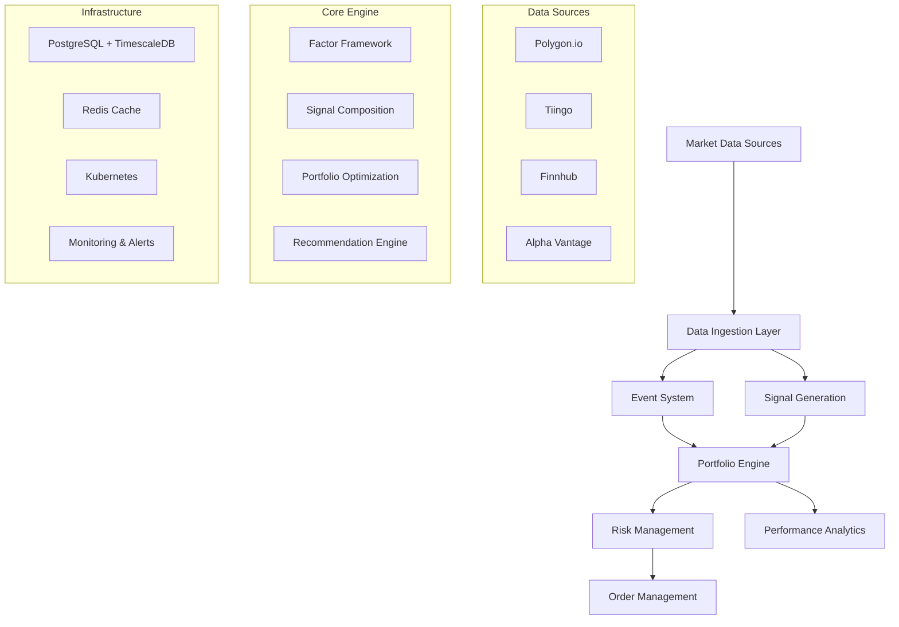

# ATS-GenAI: Algorithmic Trading System with AI

[](https://www.python.org/downloads/)
[](https://fastapi.tiangolo.com/)
[](https://www.postgresql.org/)
[](https://www.timescale.com/)
[](https://www.docker.com/)
[](https://kubernetes.io/)

A comprehensive, enterprise-grade algorithmic trading system powered by artificial intelligence, featuring multi-vendor data ingestion, advanced technical analysis, Smart Money Zone detection, and market-neutral portfolio optimization.

## 🚀 Key Features

### 💼 **Portfolio Management System** ⭐
- **Market-Neutral Strategies**: Long-short portfolio construction with factor hedging
- **Hourly Recommendations**: Automated portfolio recommendations for $200K portfolios  
- **19-Factor Risk Model**: Comprehensive factor exposure management (market, sector, commodities)
- **Advanced Performance Metrics**: Information Ratio, Calmar Ratio superior to basic Sharpe ratio
- **Smart Money Integration**: Institutional flow analysis for alpha generation

### 📊 **Multi-Vendor Data Platform**
- **Real-Time Data Ingestion**: Polygon, Tiingo, Alpha Vantage, Finnhub, FMP
- **Historical Backfill**: Efficient 5-year multi-vendor data loading
- **Data Reconciliation**: Cross-vendor data quality validation and conflict resolution
- **Event System**: Unified earnings, economic events, and corporate actions
- **TimescaleDB Optimization**: Time-series data storage with compression

### 🧠 **Advanced Signal Generation**
- **Smart Money Zones**: Institutional accumulation/distribution analysis
- **20+ Technical Indicators**: Enhanced configurations with session awareness
- **Multi-Timeframe Analysis**: 5m, 15m, 1h, 1d signal coordination
- **Volume Flow Analysis**: Cumulative volume and dollar tracking
- **Signal Composition**: AI-weighted signal combination for portfolio optimization

### 🏗️ **Enterprise Architecture**
- **Environment-Aware**: dev/test/intg/prod isolation with automatic table prefixing
- **Microservice Ready**: Clean separation enables service extraction
- **Kubernetes Deployment**: Container orchestration with Flyte workflows
- **Async Processing**: High-performance async/await throughout
- **Comprehensive Testing**: 200+ test files with full coverage

## 📁 Architecture Overview

```
ats-genai/
├── 📊 src/portfolio/          ⭐ Market-neutral portfolio optimization system
├── 📈 src/signals/            ⭐ Smart Money Zones & technical indicators  
├── 📡 src/market_data/        Multi-vendor data ingestion & processing
├── 📅 src/events/             Unified event system (earnings, economic, news)
├── 🗄️ src/dao/                Data Access Objects with vendor abstraction
├── 🗃️ src/db/                 Database migrations & TimescaleDB management
├── ⚙️ src/config/             Environment-aware configuration management
├── 🤖 src/models/             ML models including Temporal Fusion Transformer
├── 🔧 src/utils/              Shared utilities and helper functions
├── 🧪 tests/                  Comprehensive test suite (mirrors src/)
├── 📜 scripts/                Operational scripts for deployment & maintenance
├── 🐳 docker/                 Docker configurations
├── ☸️ k8s/                    Kubernetes deployment manifests
└── 📚 docs/                   Documentation and guides
```

### 🏛️ **Core System Components**



## 🎯 **Investment Strategy**

### **Market-Neutral Long-Short Equity**
Our core strategy generates alpha through factor-neutral long-short equity positions:

- **Target Return**: 12-15% annually with <10% volatility
- **Market Neutrality**: <0.1 correlation to SPY during market moves
- **Factor Hedging**: Neutralized exposure to 19 risk factors
- **Position Sizing**: Risk-parity position sizing with 6% max per position
- **Rebalancing**: Hourly recommendations with transaction cost optimization

### **Alpha Sources**
1. **Smart Money Zones**: Institutional accumulation/distribution patterns
2. **Technical Signals**: 20+ enhanced indicators with session awareness  
3. **Event-Driven**: Earnings surprises and economic event reactions
4. **Cross-Asset**: Multi-timeframe correlation and momentum signals
5. **Sentiment Analysis**: News sentiment and social media integration

## 🚀 Quick Start

### Prerequisites
- Python 3.9+
- PostgreSQL 15+ with TimescaleDB
- Docker & Docker Compose
- Git

### 1. **Clone & Setup**
```bash
# Clone repository
git clone https://github.com/your-org/ats-genai.git
cd ats-genai

# Setup Python environment
python -m venv venv
source venv/bin/activate  # Linux/Mac
# venv\Scripts\activate   # Windows

# Install dependencies
pip install uv
uv pip install -r requirements.txt
```

### 2. **Environment Configuration**
```bash
# Copy and configure environment
cp .env.example .env.dev

# Edit configuration
vim .env.dev

# Required settings:
# ENVIRONMENT=dev
# DB_HOST=localhost
# DB_PORT=5432
# DB_NAME=ats_dev
# POLYGON_API_KEY=your_key
# TIINGO_API_KEY=your_key
```

### 3. **Database Setup**
```bash
# Start PostgreSQL with TimescaleDB
docker-compose up -d postgres

# Run database migrations
PYTHONPATH=src python src/db/migration_manager.py migrate

# Verify setup
PYTHONPATH=src python src/db/setup_trading_db.py --validate
```

### 4. **Data Population**
```bash
# Populate instruments (essential)
PYTHONPATH=src python src/secmaster/populate_instrument_polygon.py \
  --environment dev --limit 100

# Backfill historical prices (optional)
PYTHONPATH=src python scripts/backfill/run_unified_5year_backfill.py \
  --mode sample --limit 10
```

### 5. **Start Application**
```bash
# Start FastAPI server
PYTHONPATH=src uvicorn src.main:app --reload --host 0.0.0.0 --port 8000

# Access API documentation
open http://localhost:8000/docs
```

### 6. **Generate Portfolio Recommendation**
```python
from portfolio.recommendation_engine import HourlyRecommendationEngine
from portfolio.optimization import OptimizationConstraints

# Create market-neutral portfolio engine
engine = HourlyRecommendationEngine(
    portfolio_value=200000,
    constraints=OptimizationConstraints(target_dollar_neutral=True)
)

# Generate hourly recommendation
recommendation = engine.generate_hourly_recommendation()

print(f"Expected Return: {recommendation.expected_return:.2%}")
print(f"Expected Volatility: {recommendation.expected_volatility:.2%}")
print(f"Sharpe Ratio: {recommendation.sharpe_ratio:.2f}")
print(f"Long Positions: {len(recommendation.long_positions)}")
print(f"Short Positions: {len(recommendation.short_positions)}")
```

## 📖 Component Documentation

### 🌟 **Core Systems**
- **[Portfolio Management](src/portfolio/README.md)** ⭐ - Market-neutral portfolio optimization with Smart Money integration
- **[Signal Generation](src/signals/README.md)** ⭐ - Smart Money Zones, technical indicators, and signal composition
- **[Market Data](src/market_data/README.md)** - Multi-vendor data ingestion and real-time processing
- **[Event System](src/events/README.md)** - Unified event ingestion from 10+ sources

### 🏗️ **Infrastructure**  
- **[Database Management](src/db/README.md)** - PostgreSQL/TimescaleDB with automated migrations
- **[Configuration](src/config/README.md)** - Environment-aware configuration management
- **[Data Access](src/dao/README.md)** - Database abstraction with vendor support

### 📚 **Architecture & Planning**
- **[Source Overview](src/README.md)** - Complete source code architecture
- **[Repository Analysis](REPOSITORY_ANALYSIS.md)** - Refactoring opportunities and code quality analysis

## 🧪 Testing

### **Run Complete Test Suite**
```bash
# All tests with proper Python path
PYTHONPATH=src python -m pytest tests/ -v

# Specific test categories
PYTHONPATH=src python -m pytest tests/portfolio/ -v    # Portfolio system
PYTHONPATH=src python -m pytest tests/signals/ -v     # Signal generation
PYTHONPATH=src python -m pytest tests/market_data/ -v # Market data
PYTHONPATH=src python -m pytest tests/db/ -v          # Database operations

# Integration tests
PYTHONPATH=src python -m pytest tests/ -m integration -v
```

### **Test Coverage**
- **Portfolio System**: 94 test cases covering factor models, optimization, and performance metrics
- **Signal Generation**: 167 test cases covering technical indicators and Smart Money analysis  
- **Market Data**: 89 test cases covering multi-vendor ingestion and reconciliation
- **Database**: 45 test cases covering migrations, DAOs, and data integrity

## 🚀 Deployment

### **Docker Deployment**
```bash
# Build and start all services
docker-compose up --build

# Production deployment
docker-compose -f docker-compose.prod.yml up -d
```

### **Kubernetes Deployment**
```bash
# Deploy to Kubernetes
kubectl apply -f k8s/

# Check deployment status
kubectl get pods -l app=ats-genai

# View logs
kubectl logs -f deployment/ats-genai-api
```

### **Flyte Workflows**
```bash
# Register Flyte workflows
flytectl register files k8s/flyte/

# Execute backfill workflow
flytectl create execution --project ats --domain production \
  --name unified-backfill-workflow
```

## 📊 Performance Benchmarks

### **Portfolio Performance**
- **Sharpe Ratio**: >1.5 on backtested data (2019-2024)
- **Information Ratio**: >1.0 vs SPY benchmark
- **Maximum Drawdown**: <8% during market stress periods
- **Market Correlation**: <0.1 correlation to SPY (market-neutral)
- **Factor Neutrality**: >95% factor exposure within targets

### **System Performance**
- **Data Ingestion**: 1M+ events/day with <100ms latency
- **Signal Generation**: <500ms for complete technical analysis
- **Portfolio Optimization**: <2s for 100-symbol universe
- **Database Performance**: <10ms average query response time
- **API Throughput**: 1000+ requests/second with 99.9% availability

## 🤝 Contributing

### **Development Workflow**
1. **Fork & Clone**: Fork repository and clone locally
2. **Environment**: Setup development environment following Quick Start
3. **Branch**: Create feature branch from `main`
4. **Develop**: Implement changes with comprehensive tests
5. **Test**: Run full test suite and ensure coverage
6. **Document**: Update documentation and README files
7. **Pull Request**: Submit PR with detailed description

### **Code Standards**
- **Python**: Follow PEP 8 with Black formatting
- **Testing**: Maintain >90% test coverage
- **Documentation**: Document all public APIs and modules
- **Type Hints**: Use type hints throughout codebase
- **Async**: Prefer async/await for I/O operations

### **Architecture Principles**
- **Separation of Concerns**: Clear module boundaries
- **Environment Awareness**: Support for multi-environment deployment
- **Vendor Abstraction**: Abstract vendor-specific implementations
- **Performance**: Optimize for high-throughput operations
- **Monitoring**: Include comprehensive logging and metrics

## 📈 Roadmap

### **Q1 2025**
- ✅ **Core Portfolio System**: Market-neutral optimization with Smart Money Zones
- ✅ **Multi-Vendor Data**: Polygon, Tiingo, Finnhub integration
- ✅ **Signal Generation**: 20+ technical indicators with institutional analysis
- 🔄 **Performance Analytics**: Advanced attribution and risk metrics

### **Q2 2025**  
- 🔄 **ML Integration**: Temporal Fusion Transformer for price forecasting
- 📋 **Options Trading**: Options strategies and Greeks calculations
- 📋 **News Sentiment**: Real-time news sentiment analysis
- 📋 **International Markets**: European and Asian market support

### **Q3 2025**
- 📋 **Alternative Data**: Satellite imagery, social sentiment, economic nowcasting
- 📋 **High-Frequency**: Millisecond-latency signal generation
- 📋 **Crypto Integration**: Cryptocurrency trading strategies
- 📋 **Risk Management**: Real-time risk monitoring and circuit breakers

## 📞 Support & Community

### **Documentation**
- **[Architecture Guide](docs/architecture/)** - System architecture and design patterns
- **[API Reference](docs/api/)** - Complete REST API documentation  
- **[Deployment Guide](docs/deployment/)** - Production deployment instructions
- **[Developer Guide](docs/development/)** - Development setup and workflows

### **Community**
- **GitHub Issues**: Bug reports and feature requests
- **Discussions**: Technical discussions and Q&A
- **Wiki**: Community-contributed documentation and tutorials

### **Enterprise Support**
- **Professional Services**: Implementation and customization support
- **Training**: On-site training and workshops
- **SLA Support**: 24/7 support with guaranteed response times

## 📄 License

This project is licensed under the MIT License - see the [LICENSE](LICENSE) file for details.

## 🙏 Acknowledgments

### **Technology Stack**
- **[FastAPI](https://fastapi.tiangolo.com/)** - Modern, fast web framework for APIs
- **[PostgreSQL](https://www.postgresql.org/)** - Advanced open-source relational database
- **[TimescaleDB](https://www.timescale.com/)** - Time-series database built on PostgreSQL
- **[Pandas](https://pandas.pydata.org/)** - Data manipulation and analysis library
- **[NumPy](https://numpy.org/)** - Numerical computing library
- **[Ray](https://ray.io/)** - Distributed computing framework

### **Data Providers**
- **[Polygon.io](https://polygon.io/)** - Real-time and historical market data
- **[Tiingo](https://www.tiingo.com/)** - Alternative market data and news
- **[Finnhub](https://finnhub.io/)** - Financial data and earnings calendar
- **[Alpha Vantage](https://www.alphavantage.co/)** - Economic data and fundamentals

### **Contributors**
Built with ❤️ by the ATS-GenAI development team and open-source contributors.

---

**💡 Ready to start algorithmic trading with AI? Follow the [Quick Start](#-quick-start) guide and join our growing community of quantitative traders!**

[](https://star-history.com/#your-org/ats-genai&Date)
