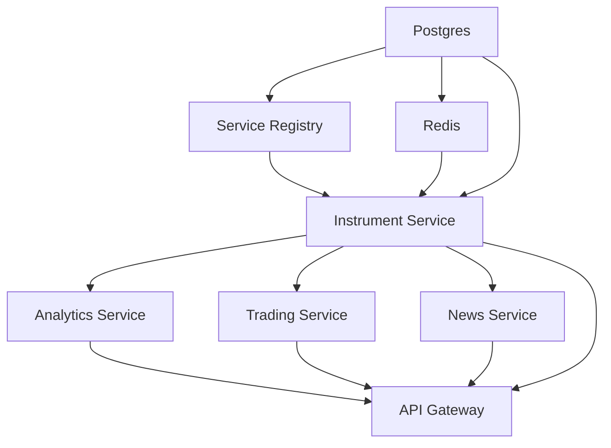

# ATS Service-Based Architecture Deployment Guide

This guide provides comprehensive instructions for deploying the ATS service-based architecture across different environments.

## 📋 Table of Contents

- [Architecture Overview](#architecture-overview)
- [Quick Start](#quick-start)
- [Environment Setup](#environment-setup)
- [Docker Compose Deployment](#docker-compose-deployment)
- [Kubernetes Deployment](#kubernetes-deployment)
- [CI/CD Pipeline](#cicd-pipeline)
- [Monitoring & Health Checks](#monitoring--health-checks)
- [Troubleshooting](#troubleshooting)

## 🏗️ Architecture Overview

### Service Components

| Service | Port | Purpose | Dependencies |
|---------|------|---------|--------------|
| **Service Registry** | 8500 | Service discovery & health monitoring | None |
| **Instrument Service** | 8001 | Vendor instruments, xrefs, unified instruments | Postgres, Redis, Service Registry |
| **Analytics Service** | 8002 | Technical indicators, performance metrics | Postgres, Redis, Instrument Service |
| **Trading Service** | 8003 | Portfolios, positions, orders | Postgres, Redis, Instrument Service |
| **News Service** | 8004 | Articles, sentiment analysis | Postgres, Redis, External APIs |
| **API Gateway** | 8000 | Unified entry point, routing | All business services |

### Infrastructure Components

| Component | Port | Purpose |
|-----------|------|---------|
| **PostgreSQL** | 5433 | Primary database (TimescaleDB) |
| **Redis** | 6380 | Caching & session storage |
| **Prometheus** | 9090 | Metrics collection |
| **Grafana** | 3001 | Monitoring dashboards |

## 🚀 Quick Start

### Prerequisites

```bash
# Required software
- Docker 24.0+ with Compose V2
- Python 3.11+
- kubectl (for Kubernetes deployment)
- curl (for health checks)

# Minimum system resources
- 8GB RAM
- 4 CPU cores  
- 20GB free disk space
```

### 1. Clone and Setup

```bash
git clone <repository-url>
cd ats-genai-data

# Make deployment script executable
chmod +x deployment/scripts/deploy-services.sh
```

### 2. Start Development Environment

```bash
# Start all services in development mode
./deployment/scripts/deploy-services.sh deploy -e dev

# Check service health
./deployment/scripts/deploy-services.sh health
```

### 3. Access Services

| Service | URL | Purpose |
|---------|-----|---------|
| API Gateway | http://localhost:8000 | Main API entry point |
| Service Registry | http://localhost:8500 | Service discovery UI |
| Instruments API | http://localhost:8001/docs | Instrument service docs |
| Grafana | http://localhost:3001 | Monitoring (admin/admin123) |
| Prometheus | http://localhost:9090 | Metrics |

## 🔧 Environment Setup

### Development Environment

```bash
# Start development services
./deployment/scripts/deploy-services.sh start -e dev

# Follow logs
./deployment/scripts/deploy-services.sh logs -f

# Scale analytics service
./deployment/scripts/deploy-services.sh scale -s analytics-service -r 3
```

### Staging Environment

```bash
# Deploy to staging
./deployment/scripts/deploy-services.sh deploy -e staging

# Check specific service
./deployment/scripts/deploy-services.sh logs -s instrument-service -f
```

### Production Environment

```bash
# Production deployment with monitoring
./deployment/scripts/deploy-services.sh deploy -e production

# Health monitoring
./deployment/scripts/deploy-services.sh health
```

## 🐳 Docker Compose Deployment

### Architecture

```yaml
# Network topology
networks:
  ats-services-network:
    driver: bridge
    subnet: 172.20.0.0/16

# Service placement
postgres-services:    172.20.0.10
redis-services:       172.20.0.11  
service-registry:     172.20.0.20
instrument-service:   172.20.0.30
analytics-service:    172.20.0.31
trading-service:      172.20.0.32
news-service:         172.20.0.33
api-gateway:          172.20.0.40
```

### Service Dependencies



### Environment Variables

```bash
# Database Configuration
DB_HOST=ats-services-postgres
DB_PORT=5432
DB_USER=services_user
DB_PASSWORD=services_password

# Service Discovery
SERVICE_REGISTRY_URL=http://service-registry:8500

# Caching
REDIS_HOST=ats-services-redis
REDIS_PORT=6379
REDIS_PASSWORD=services_redis_password

# External APIs
POLYGON_API_KEY=wfrcZNX3ZJJt55Or_CmBXda8G8e8tABD
```

### Common Commands

```bash
# Start core infrastructure
docker compose -f deployment/docker-compose.services.yml up -d postgres-services redis-services

# Start specific service
docker compose -f deployment/docker-compose.services.yml up -d instrument-service

# View logs
docker compose -f deployment/docker-compose.services.yml logs -f instrument-service

# Scale service
docker compose -f deployment/docker-compose.services.yml up -d --scale analytics-service=3

# Stop all services
docker compose -f deployment/docker-compose.services.yml down

# Clean up with volumes
docker compose -f deployment/docker-compose.services.yml down -v
```

## ☸️ Kubernetes Deployment

### Prerequisites

```bash
# Kubernetes cluster requirements
- Kubernetes 1.25+
- kubectl configured
- Container registry access
- Persistent volume provisioner
- Ingress controller (optional)
```

### Deploy to Kubernetes

```bash
# Create namespace and RBAC
kubectl apply -f deployment/kubernetes/namespace.yaml

# Deploy infrastructure
kubectl apply -f deployment/kubernetes/postgres.yaml
kubectl apply -f deployment/kubernetes/redis.yaml

# Deploy services
kubectl apply -f deployment/kubernetes/service-registry.yaml
kubectl apply -f deployment/kubernetes/instrument-service.yaml
kubectl apply -f deployment/kubernetes/api-gateway.yaml

# Monitor deployment
kubectl get pods -n ats-services -w
```

### Service Configuration

```yaml
# Horizontal Pod Autoscaler
spec:
  minReplicas: 2
  maxReplicas: 10
  metrics:
  - type: Resource
    resource:
      name: cpu
      target:
        averageUtilization: 70

# Pod Disruption Budget
spec:
  minAvailable: 1
  selector:
    matchLabels:
      app: instrument-service
```

### Resource Limits

```yaml
resources:
  requests:
    memory: "256Mi"
    cpu: "250m"
  limits:
    memory: "512Mi" 
    cpu: "500m"
```

## 🔄 CI/CD Pipeline

### GitHub Actions Workflow

The CI/CD pipeline includes:

1. **Testing Phase**
   - Unit tests for all components
   - Integration tests with real databases
   - Code quality checks (linting, security)

2. **Build Phase**
   - Multi-architecture Docker images
   - Container registry push
   - Image vulnerability scanning

3. **Deployment Phase**
   - Staging deployment (develop branch)
   - Production deployment (main branch)
   - Blue/green deployment strategy

### Pipeline Configuration

```yaml
# Environments
staging:
  - Auto-deploy on develop branch
  - Smoke tests after deployment
  - Slack notifications

production:
  - Manual approval required
  - Blue/green deployment
  - Comprehensive monitoring
  - Rollback capability
```

### Deployment Strategy

```bash
# Blue/Green Deployment Process
1. Deploy to green environment
2. Run production smoke tests
3. Switch traffic to green
4. Monitor for issues
5. Clean up blue environment
```

## 📊 Monitoring & Health Checks

### Health Check Endpoints

| Service | Health Endpoint | Details |
|---------|----------------|---------|
| Service Registry | `GET /health` | Registry status, service count |
| Instrument Service | `GET /health` | Business logic, DB, dependencies |
| API Gateway | `GET /health` | Service connectivity, routing |

### Health Check Types

```json
{
  "status": "healthy",
  "checks": [
    {
      "name": "database_connectivity",
      "type": "dependency", 
      "status": "healthy",
      "duration_ms": 45.2
    },
    {
      "name": "business_logic",
      "type": "readiness",
      "status": "healthy",
      "details": {
        "processed_items": 1250,
        "cache_hit_rate": 94.5
      }
    }
  ]
}
```

### Monitoring Stack

```bash
# Prometheus Metrics
- Service availability
- Response times
- Error rates
- Resource utilization

# Grafana Dashboards
- Service overview
- Database performance
- API gateway metrics
- Custom business metrics

# Alerting Rules
- Service downtime
- High error rates
- Resource exhaustion
- Database connectivity
```

### Performance Monitoring

```bash
# Key Metrics to Monitor
- Request latency (p95, p99)
- Throughput (requests/second)
- Error rates by service
- Circuit breaker status
- Cache hit rates
- Database connection pools
```

## 🔧 Troubleshooting

### Common Issues

#### Service Discovery Problems

```bash
# Symptoms
- Services can't find each other
- Connection refused errors
- Circuit breakers opening

# Diagnosis
kubectl logs service-registry -n ats-services
curl http://localhost:8500/services

# Solutions
- Check service registration
- Verify network connectivity
- Review health check configuration
```

#### Database Connection Issues

```bash
# Symptoms
- Services failing to start
- Database timeout errors
- Connection pool exhausted

# Diagnosis
kubectl exec -it postgres-0 -n ats-services -- psql -U services_user -d ats_services

# Solutions
- Check database credentials
- Verify database is running
- Review connection pool settings
```

#### Performance Issues

```bash
# Symptoms
- High response times
- Service timeouts
- Memory/CPU exhaustion

# Diagnosis
kubectl top pods -n ats-services
docker stats

# Solutions
- Scale services horizontally
- Optimize database queries
- Increase resource limits
- Enable caching
```

### Debug Commands

```bash
# Service health
curl -f http://localhost:8000/health | jq

# Service discovery
curl -f http://localhost:8500/services | jq

# Container logs
docker logs ats-instrument-service --tail 100 -f

# Resource usage
docker stats --no-stream

# Network connectivity
docker exec ats-instrument-service ping ats-services-postgres

# Database connectivity
docker exec ats-services-postgres pg_isready -U services_user
```

### Log Analysis

```bash
# Structured log format
{
  "timestamp": "2024-01-15T10:30:45Z",
  "level": "ERROR",
  "service": "instrument-service",
  "message": "Database connection failed",
  "error": "connection timeout",
  "trace_id": "abc123"
}

# Common log patterns
- Service startup/shutdown
- Database queries and errors
- API requests and responses
- Circuit breaker state changes
- Health check results
```

### Recovery Procedures

```bash
# Service Recovery
1. Check service logs
2. Verify dependencies
3. Restart service if needed
4. Scale if performance issue

# Database Recovery
1. Check database status
2. Review connection limits
3. Restart database if needed
4. Run health checks

# Full System Recovery
1. Stop all services
2. Start infrastructure first
3. Start services in dependency order
4. Verify health checks pass
```

## 🔐 Security Considerations

### Network Security

```bash
# Container network isolation
- Services communicate via internal network
- No direct external access to business services
- API Gateway as single entry point

# Kubernetes NetworkPolicy
- Ingress rules for each service
- Egress rules for external dependencies
- Namespace isolation
```

### Secrets Management

```bash
# Environment Variables
- Database passwords
- API keys  
- Redis passwords
- Service certificates

# Kubernetes Secrets
- Base64 encoded
- Mounted as environment variables
- RBAC controlled access
```

### Best Practices

```bash
# Security Checklist
□ Run containers as non-root user
□ Use read-only root filesystem where possible
□ Implement proper RBAC
□ Rotate secrets regularly
□ Monitor for vulnerabilities
□ Use TLS for inter-service communication
□ Implement proper logging and auditing
```

---

## 📞 Support

For deployment issues or questions:

1. Check the logs first: `./deployment/scripts/deploy-services.sh logs`
2. Verify service health: `./deployment/scripts/deploy-services.sh health`  
3. Review this guide for common solutions
4. Check service discovery: `curl http://localhost:8500/services`

**Remember**: Always test deployments in development environment first!