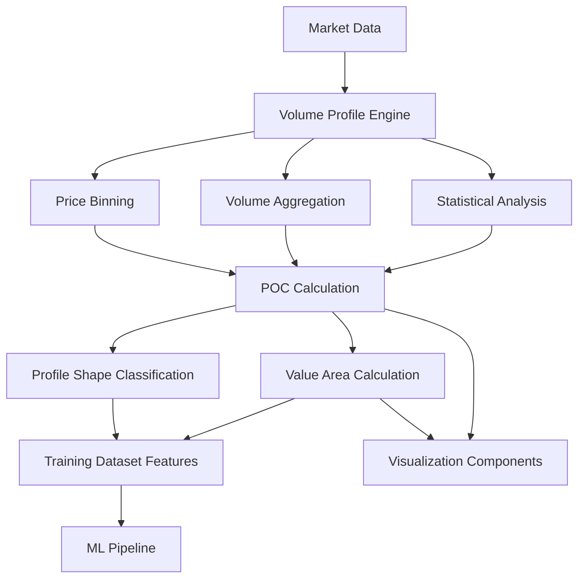

# Design Requirements Document (DRD)
# Volume Profile Technical Indicator Implementation

**Document Version**: 1.0
**Date**: September 6, 2025
**Author**: ATS Platform Engineering Team
**Related Documents**: PRD-volume-profile.md, GitHub Issues

## Document Overview

This Design Requirements Document (DRD) provides detailed technical specifications for implementing Volume Profile indicators within the ATS platform. This document translates business requirements from the PRD into specific technical implementation details.

## System Architecture

### High-Level Architecture
```
┌─────────────────────────────────────────────────────────────────┐
│                      ATS Volume Profile System                  │
├─────────────────────────────────────────────────────────────────┤
│  Application Layer                                              │
│  ┌─────────────────┐ ┌─────────────────┐ ┌─────────────────┐   │
│  │   Visualization │ │  Training Data  │ │   Configuration │   │
│  │   Components    │ │   Integration   │ │   Management    │   │
│  └─────────────────┘ └─────────────────┘ └─────────────────┘   │
├─────────────────────────────────────────────────────────────────┤
│  Core Indicator Layer                                          │
│  ┌─────────────────┐ ┌─────────────────┐ ┌─────────────────┐   │
│  │ VolumeProfile   │ │ ProfileShape    │ │  VolumeProfile  │   │
│  │ (Framework)     │ │ Classifier      │ │  (Enhanced)     │   │
│  └─────────────────┘ └─────────────────┘ └─────────────────┘   │
├─────────────────────────────────────────────────────────────────┤
│  Data Processing Layer                                         │
│  ┌─────────────────┐ ┌─────────────────┐ ┌─────────────────┐   │
│  │  Price Binning  │ │ Volume Aggreg.  │ │   Statistical   │   │
│  │    Engine       │ │     Engine      │ │   Calculator    │   │
│  └─────────────────┘ └─────────────────┘ └─────────────────┘   │
├─────────────────────────────────────────────────────────────────┤
│  Data Access Layer                                             │
│  ┌─────────────────┐ ┌─────────────────┐ ┌─────────────────┐   │
│  │  Market Data    │ │   Caching       │ │    Validation   │   │
│  │   Manager       │ │   Layer         │ │     Engine      │   │
│  └─────────────────┘ └─────────────────┘ └─────────────────┘   │
└─────────────────────────────────────────────────────────────────┘
```

### Component Relationships


## Detailed Design Specifications

### Core Data Structures

#### Volume Profile Data Structure
```python
@dataclass
class VolumeProfileResult:
    """Core volume profile calculation result."""
    poc: float                              # Point of Control price
    vah: float                             # Value Area High
    val: float                             # Value Area Low
    value_area_volume_pct: float           # Percentage of volume in VA
    total_volume: float                    # Total volume in profile
    volume_distribution: Dict[float, float] # Price -> Volume mapping
    profile_shape: ProfileShape            # Classified shape
    dominant_side: MarketBias              # Bullish/Bearish/Neutral
    calculation_metadata: ProfileMetadata   # Calculation details

@dataclass
class ProfileMetadata:
    """Metadata about profile calculation."""
    period: int                            # Lookback period used
    bin_count: int                         # Number of price bins
    price_range: Tuple[float, float]       # Min/Max prices in profile
    calculation_timestamp: datetime        # When calculated
    data_quality_score: float              # Data completeness (0-1)

@dataclass
class VolumeBin:
    """Individual price bin in volume profile."""
    price_level: float                     # Center price of bin
    price_range: Tuple[float, float]       # Min/Max price range
    volume: float                          # Total volume in bin
    bar_count: int                         # Number of bars contributing
    volume_percentage: float               # Percentage of total volume
```

#### Enumerations
```python
class ProfileShape(Enum):
    """Volume profile shape classifications."""
    BALANCED = "balanced"                  # Single peak, normal distribution
    TRENDING = "trending"                  # Skewed distribution
    ROTATIONAL = "rotational"              # Multiple peaks
    DOUBLE_DISTRIBUTION = "double"         # Two distinct peaks
    UNDEFINED = "undefined"                # Unable to classify

class MarketBias(Enum):
    """Market bias based on volume profile."""
    BULLISH = "bullish"                    # Volume concentrated at higher prices
    BEARISH = "bearish"                    # Volume concentrated at lower prices
    NEUTRAL = "neutral"                    # Balanced volume distribution
```

### Algorithm Specifications

#### Price Binning Algorithm
```python
class AdaptivePriceBinning:
    """Adaptive price binning based on volatility."""

    def __init__(self, atr_multiplier: float = 1.0, min_bins: int = 20, max_bins: int = 100):
        self.atr_multiplier = atr_multiplier
        self.min_bins = min_bins
        self.max_bins = max_bins

    def calculate_bin_size(self, price_data: List[float], atr_value: float) -> float:
        """Calculate optimal bin size based on ATR and price range."""
        price_range = max(price_data) - min(price_data)

        # Base bin size on ATR for volatility adaptation
        atr_based_size = atr_value * self.atr_multiplier

        # Ensure reasonable number of bins
        range_based_size = price_range / self.max_bins

        # Use the larger of ATR-based or range-based sizing
        return max(atr_based_size, range_based_size)

    def create_bins(self, price_data: List[float], bin_size: float) -> List[Tuple[float, float]]:
        """Create price bin ranges."""
        min_price = min(price_data)
        max_price = max(price_data)

        bins = []
        current_price = min_price

        while current_price < max_price:
            bin_start = current_price
            bin_end = min(current_price + bin_size, max_price)
            bins.append((bin_start, bin_end))
            current_price = bin_end

        return bins
```

#### Volume Aggregation Algorithm
```python
class VolumeAggregationEngine:
    """Aggregates volume data into price bins."""

    def aggregate_volume(self,
                        intervals: List[InstrumentInterval],
                        bins: List[Tuple[float, float]]) -> Dict[float, float]:
        """Aggregate volume into price bins."""
        bin_volumes = {self._bin_center(bin_range): 0.0 for bin_range in bins}

        for interval in intervals:
            # Distribute volume across price range using OHLC
            price_points = [interval.open, interval.high, interval.low, interval.close]
            volume_per_point = interval.traded_volume / 4  # Equal distribution

            for price in price_points:
                bin_center = self._find_bin_for_price(price, bins)
                if bin_center:
                    bin_volumes[bin_center] += volume_per_point

        return bin_volumes

    def _bin_center(self, bin_range: Tuple[float, float]) -> float:
        """Calculate center price of bin."""
        return (bin_range[0] + bin_range[1]) / 2

    def _find_bin_for_price(self, price: float, bins: List[Tuple[float, float]]) -> Optional[float]:
        """Find which bin contains the given price."""
        for bin_start, bin_end in bins:
            if bin_start <= price < bin_end:
                return (bin_start + bin_end) / 2
        return None
```

#### Point of Control (POC) Calculation
```python
class POCCalculator:
    """Calculates Point of Control from volume distribution."""

    def calculate_poc(self, volume_distribution: Dict[float, float]) -> float:
        """Find price level with highest volume (POC)."""
        if not volume_distribution:
            raise ValueError("Volume distribution is empty")

        return max(volume_distribution.items(), key=lambda x: x[1])[0]

    def calculate_poc_with_smoothing(self,
                                   volume_distribution: Dict[float, float],
                                   smoothing_window: int = 3) -> float:
        """Calculate POC with volume smoothing to reduce noise."""
        if smoothing_window <= 1:
            return self.calculate_poc(volume_distribution)

        sorted_prices = sorted(volume_distribution.keys())
        smoothed_volumes = {}

        for i, price in enumerate(sorted_prices):
            # Calculate smoothed volume using neighboring bins
            window_start = max(0, i - smoothing_window // 2)
            window_end = min(len(sorted_prices), i + smoothing_window // 2 + 1)

            window_volumes = [volume_distribution[sorted_prices[j]]
                            for j in range(window_start, window_end)]
            smoothed_volumes[price] = sum(window_volumes) / len(window_volumes)

        return max(smoothed_volumes.items(), key=lambda x: x[1])[0]
```

#### Value Area Calculation
```python
class ValueAreaCalculator:
    """Calculates Value Area High/Low containing specified percentage of volume."""

    def calculate_value_area(self,
                           volume_distribution: Dict[float, float],
                           poc: float,
                           target_percentage: float = 70.0) -> Tuple[float, float]:
        """Calculate Value Area High and Low around POC."""
        total_volume = sum(volume_distribution.values())
        target_volume = total_volume * (target_percentage / 100.0)

        # Start from POC and expand outward
        sorted_prices = sorted(volume_distribution.keys())
        poc_index = sorted_prices.index(poc)

        # Initialize with POC
        included_volume = volume_distribution[poc]
        va_low_index = poc_index
        va_high_index = poc_index

        # Expand outward alternating between higher and lower prices
        while included_volume < target_volume:
            # Check which direction has more volume
            higher_volume = 0
            lower_volume = 0

            if va_high_index + 1 < len(sorted_prices):
                higher_volume = volume_distribution[sorted_prices[va_high_index + 1]]

            if va_low_index - 1 >= 0:
                lower_volume = volume_distribution[sorted_prices[va_low_index - 1]]

            # Expand in direction with more volume
            if higher_volume >= lower_volume and va_high_index + 1 < len(sorted_prices):
                va_high_index += 1
                included_volume += volume_distribution[sorted_prices[va_high_index]]
            elif va_low_index - 1 >= 0:
                va_low_index -= 1
                included_volume += volume_distribution[sorted_prices[va_low_index]]
            else:
                break  # Cannot expand further

        return sorted_prices[va_low_index], sorted_prices[va_high_index]
```

#### Profile Shape Classification
```python
class ProfileShapeClassifier:
    """Classifies volume profile shapes using statistical analysis."""

    def classify_profile(self, volume_distribution: Dict[float, float]) -> ProfileShape:
        """Classify the shape of volume profile."""
        if len(volume_distribution) < 5:
            return ProfileShape.UNDEFINED

        volumes = list(volume_distribution.values())
        prices = list(volume_distribution.keys())

        # Calculate statistical measures
        skewness = self._calculate_skewness(volumes)
        kurtosis = self._calculate_kurtosis(volumes)
        peak_count = self._count_peaks(volumes)

        # Classification rules
        if abs(skewness) < 0.5 and kurtosis > 2.5 and peak_count == 1:
            return ProfileShape.BALANCED
        elif abs(skewness) > 1.0:
            return ProfileShape.TRENDING
        elif peak_count >= 2:
            return ProfileShape.DOUBLE_DISTRIBUTION if peak_count == 2 else ProfileShape.ROTATIONAL
        else:
            return ProfileShape.BALANCED

    def _calculate_skewness(self, values: List[float]) -> float:
        """Calculate skewness of distribution."""
        import numpy as np
        from scipy import stats
        return stats.skew(values)

    def _calculate_kurtosis(self, values: List[float]) -> float:
        """Calculate kurtosis of distribution."""
        from scipy import stats
        return stats.kurtosis(values)

    def _count_peaks(self, values: List[float], prominence: float = 0.1) -> int:
        """Count number of peaks in volume distribution."""
        from scipy.signal import find_peaks
        peaks, _ = find_peaks(values, prominence=max(values) * prominence)
        return len(peaks)
```

### Implementation Classes

#### Core Volume Profile Indicator
```python
class VolumeProfile(Indicator):
    """Volume Profile indicator for existing framework."""

    def __init__(self,
                 period: int = 20,
                 bin_count: int = 50,
                 value_area_pct: float = 70.0,
                 atr_multiplier: float = 1.0):
        super().__init__()
        self.period = period
        self.bin_count = bin_count
        self.value_area_pct = value_area_pct
        self.atr_multiplier = atr_multiplier

        # Core calculation engines
        self.binning_engine = AdaptivePriceBinning(atr_multiplier, 10, bin_count)
        self.volume_engine = VolumeAggregationEngine()
        self.poc_calculator = POCCalculator()
        self.va_calculator = ValueAreaCalculator()
        self.shape_classifier = ProfileShapeClassifier()

        # Results storage
        self.latest_result: Optional[VolumeProfileResult] = None

    def update(self, intervals: List[InstrumentInterval]):
        """Update volume profile calculation with new data."""
        self.update_at = datetime.now()

        if len(intervals) < self.period:
            self.status = 'insufficient_data'
            self.latest_result = None
            return

        try:
            # Validate data
            if not self._validate_intervals(intervals[-self.period:]):
                self.status = 'invalid_data'
                self.latest_result = None
                return

            # Calculate volume profile
            result = self._calculate_volume_profile(intervals[-self.period:])
            self.latest_result = result
            self.status = 'ok'

        except Exception as e:
            logging.error(f"[VolumeProfile] Calculation error: {str(e)}")
            self.status = 'calculation_error'
            self.latest_result = None

    def _calculate_volume_profile(self, intervals: List[InstrumentInterval]) -> VolumeProfileResult:
        """Perform complete volume profile calculation."""
        # Extract price data for ATR calculation
        closes = [interval.close for interval in intervals]
        highs = [interval.high for interval in intervals]
        lows = [interval.low for interval in intervals]

        # Calculate ATR for adaptive binning
        atr_value = self._calculate_atr(highs, lows, closes)

        # Create price bins
        all_prices = []
        for interval in intervals:
            all_prices.extend([interval.open, interval.high, interval.low, interval.close])

        bin_size = self.binning_engine.calculate_bin_size(all_prices, atr_value)
        bins = self.binning_engine.create_bins(all_prices, bin_size)

        # Aggregate volume into bins
        volume_distribution = self.volume_engine.aggregate_volume(intervals, bins)

        # Calculate POC and Value Area
        poc = self.poc_calculator.calculate_poc_with_smoothing(volume_distribution)
        val, vah = self.va_calculator.calculate_value_area(volume_distribution, poc, self.value_area_pct)

        # Classify profile shape
        profile_shape = self.shape_classifier.classify_profile(volume_distribution)

        # Determine market bias
        total_volume = sum(volume_distribution.values())
        market_bias = self._determine_market_bias(volume_distribution, poc, total_volume)

        # Create result
        return VolumeProfileResult(
            poc=poc,
            vah=vah,
            val=val,
            value_area_volume_pct=self.value_area_pct,
            total_volume=total_volume,
            volume_distribution=volume_distribution,
            profile_shape=profile_shape,
            dominant_side=market_bias,
            calculation_metadata=ProfileMetadata(
                period=self.period,
                bin_count=len(bins),
                price_range=(min(all_prices), max(all_prices)),
                calculation_timestamp=self.update_at,
                data_quality_score=self._calculate_data_quality_score(intervals)
            )
        )

    def get_value(self) -> Optional[float]:
        """Return POC as primary indicator value."""
        return self.latest_result.poc if self.latest_result else None

    def get_value_area(self) -> Optional[Tuple[float, float]]:
        """Return Value Area High and Low."""
        if not self.latest_result:
            return None
        return (self.latest_result.val, self.latest_result.vah)

    def get_volume_distribution(self) -> Optional[Dict[float, float]]:
        """Return complete volume distribution."""
        return self.latest_result.volume_distribution if self.latest_result else None

    def get_profile_shape(self) -> Optional[ProfileShape]:
        """Return classified profile shape."""
        return self.latest_result.profile_shape if self.latest_result else None
```

#### Enhanced Framework Implementation
```python
class VolumeProfileIndicator(Indicator):
    """Volume Profile for enhanced indicators framework."""

    def __init__(self, period: int = 20, bin_count: int = 50, value_area_pct: float = 70.0):
        super().__init__()
        self.period = period
        self.bin_count = bin_count
        self.value_area_pct = value_area_pct
        self.name = f"VolumeProfile_{period}_{bin_count}"

    def calculate(self, price_history: pd.DataFrame) -> Dict[str, Any]:
        """Calculate volume profile using pandas DataFrame."""
        if len(price_history) < self.period:
            return {'value': None, 'status': 'insufficient_data'}

        try:
            # Validate required columns
            required_columns = ['open', 'high', 'low', 'close', 'volume']
            if not all(col in price_history.columns for col in required_columns):
                return {'value': None, 'status': 'missing_columns'}

            # Use last 'period' rows
            data = price_history.tail(self.period).copy()

            # Calculate volume profile using vectorized operations
            result = self._calculate_vectorized_profile(data)

            return {
                'value': result['poc'],
                'poc': result['poc'],
                'vah': result['vah'],
                'val': result['val'],
                'value_area_volume_pct': self.value_area_pct,
                'volume_distribution': result['distribution'],
                'profile_shape': result['shape'],
                'dominant_side': result['bias'],
                'total_volume': result['total_volume'],
                'status': 'valid'
            }

        except Exception as e:
            return {'value': None, 'status': f'calculation_error: {str(e)}'}

    def _calculate_vectorized_profile(self, data: pd.DataFrame) -> Dict[str, Any]:
        """Vectorized volume profile calculation using pandas/numpy."""
        import numpy as np

        # Calculate price range and bins
        all_prices = np.concatenate([data['open'], data['high'], data['low'], data['close']])
        price_min, price_max = all_prices.min(), all_prices.max()

        # Create price bins
        bin_edges = np.linspace(price_min, price_max, self.bin_count + 1)
        bin_centers = (bin_edges[:-1] + bin_edges[1:]) / 2

        # Initialize volume distribution
        volume_dist = np.zeros(self.bin_count)

        # Distribute volume across OHLC prices for each bar
        for _, row in data.iterrows():
            prices = [row['open'], row['high'], row['low'], row['close']]
            volume_per_price = row['volume'] / 4

            for price in prices:
                # Find appropriate bin
                bin_idx = np.digitize(price, bin_edges) - 1
                bin_idx = np.clip(bin_idx, 0, self.bin_count - 1)
                volume_dist[bin_idx] += volume_per_price

        # Calculate POC
        poc_idx = np.argmax(volume_dist)
        poc = bin_centers[poc_idx]

        # Calculate Value Area
        total_volume = volume_dist.sum()
        target_volume = total_volume * (self.value_area_pct / 100.0)

        # Find Value Area by expanding from POC
        included_volume = volume_dist[poc_idx]
        va_low_idx = poc_idx
        va_high_idx = poc_idx

        while included_volume < target_volume:
            # Determine which direction to expand
            expand_low = (va_low_idx > 0 and
                         (va_high_idx >= self.bin_count - 1 or
                          volume_dist[va_low_idx - 1] >= volume_dist[va_high_idx + 1]))

            if expand_low:
                va_low_idx -= 1
                included_volume += volume_dist[va_low_idx]
            elif va_high_idx < self.bin_count - 1:
                va_high_idx += 1
                included_volume += volume_dist[va_high_idx]
            else:
                break

        val = bin_centers[va_low_idx]
        vah = bin_centers[va_high_idx]

        # Create distribution dictionary
        distribution = {float(bin_centers[i]): float(volume_dist[i])
                       for i in range(self.bin_count) if volume_dist[i] > 0}

        # Classify shape (simplified)
        profile_shape = self._classify_shape_vectorized(volume_dist)

        # Determine bias
        bias = self._determine_bias_vectorized(volume_dist, poc_idx)

        return {
            'poc': float(poc),
            'vah': float(vah),
            'val': float(val),
            'distribution': distribution,
            'shape': profile_shape,
            'bias': bias,
            'total_volume': float(total_volume)
        }
```

### Performance Optimization Strategies

#### Caching Strategy
```python
class VolumeProfileCache:
    """Intelligent caching for volume profile calculations."""

    def __init__(self, max_size: int = 1000):
        from functools import lru_cache
        self.cache = {}
        self.max_size = max_size

    def get_cache_key(self,
                     intervals: List[InstrumentInterval],
                     period: int,
                     bin_count: int) -> str:
        """Generate cache key from input parameters."""
        # Use hash of last interval timestamp and parameters
        last_timestamp = intervals[-1].start_date_time.isoformat()
        data_hash = hash((last_timestamp, period, bin_count))
        return f"vp_{data_hash}"

    def get_cached_result(self, cache_key: str) -> Optional[VolumeProfileResult]:
        """Retrieve cached result if available."""
        return self.cache.get(cache_key)

    def cache_result(self, cache_key: str, result: VolumeProfileResult):
        """Cache calculation result."""
        if len(self.cache) >= self.max_size:
            # Remove oldest entry (simple FIFO)
            oldest_key = next(iter(self.cache))
            del self.cache[oldest_key]

        self.cache[cache_key] = result
```

#### Incremental Update Strategy
```python
class IncrementalVolumeProfile:
    """Incremental volume profile updates for real-time data."""

    def __init__(self, base_profile: VolumeProfile):
        self.base_profile = base_profile
        self.incremental_bins = {}
        self.last_update_bar = None

    def add_new_bar(self, new_interval: InstrumentInterval):
        """Add single new bar without full recalculation."""
        if not self.last_update_bar:
            # First update, do full calculation
            return self._full_recalculation([new_interval])

        # Remove oldest bar's contribution
        oldest_contribution = self._calculate_bar_contribution(self.last_update_bar)

        # Add new bar's contribution
        new_contribution = self._calculate_bar_contribution(new_interval)

        # Update volume distribution incrementally
        self._update_distribution_incremental(oldest_contribution, new_contribution)

        # Recalculate POC and VA from updated distribution
        self._recalculate_derived_metrics()

        self.last_update_bar = new_interval
```

### Integration Specifications

#### Training Dataset Integration
```python
# Addition to ResidualReturnIndicatorConfig
def create_comprehensive_config_with_volume_profile(cls) -> 'IndicatorConfig':
    """Enhanced config with volume profile indicators."""
    config = cls.create_comprehensive_config()

    # Add volume profile indicators
    volume_profile_configs = [
        ('VolumeProfile_20_50', lambda: VolumeProfileIndicator(20, 50)),
        ('VolumeProfile_20_30', lambda: VolumeProfileIndicator(20, 30)),
        ('VolumeProfile_14_40', lambda: VolumeProfileIndicator(14, 40)),
        ('VolumeProfile_30_60', lambda: VolumeProfileIndicator(30, 60)),
    ]

    for name, factory in volume_profile_configs:
        config.add_indicator(name, factory)

    return config
```

#### Visualization Integration
```python
class VolumeProfileVisualization:
    """Volume profile chart visualization components."""

    def render_volume_profile(self,
                            profile_result: VolumeProfileResult,
                            chart_bounds: Tuple[float, float, float, float]) -> Dict[str, Any]:
        """Render volume profile as chart overlay."""

        # Chart bounds: (x_min, x_max, y_min, y_max)
        chart_x_min, chart_x_max, chart_y_min, chart_y_max = chart_bounds

        # Volume profile renders on right side of chart
        profile_x_start = chart_x_max * 0.85  # Start at 85% of chart width
        profile_x_width = chart_x_max * 0.15  # Use 15% of chart width

        # Scale volume bars to fit within allocated space
        max_volume = max(profile_result.volume_distribution.values())

        volume_bars = []
        for price, volume in profile_result.volume_distribution.items():
            bar_width = (volume / max_volume) * profile_x_width

            volume_bars.append({
                'price': price,
                'x_start': profile_x_start,
                'x_end': profile_x_start + bar_width,
                'volume': volume,
                'is_poc': abs(price - profile_result.poc) < 0.01,
                'in_value_area': profile_result.val <= price <= profile_result.vah
            })

        # Create level lines for POC, VAH, VAL
        level_lines = [
            {
                'price': profile_result.poc,
                'type': 'poc',
                'style': {'color': '#FF6B35', 'width': 3, 'dash': 'solid'},
                'x_start': chart_x_min,
                'x_end': chart_x_max
            },
            {
                'price': profile_result.vah,
                'type': 'vah',
                'style': {'color': '#4ECDC4', 'width': 2, 'dash': 'dashed'},
                'x_start': chart_x_min,
                'x_end': chart_x_max
            },
            {
                'price': profile_result.val,
                'type': 'val',
                'style': {'color': '#4ECDC4', 'width': 2, 'dash': 'dashed'},
                'x_start': chart_x_min,
                'x_end': chart_x_max
            }
        ]

        return {
            'volume_bars': volume_bars,
            'level_lines': level_lines,
            'profile_metadata': {
                'shape': profile_result.profile_shape.value,
                'bias': profile_result.dominant_side.value,
                'total_volume': profile_result.total_volume
            }
        }
```

## Testing Strategy

### Unit Test Architecture
- **Test Coverage**: >95% line coverage requirement
- **Test Categories**: Calculation accuracy, edge cases, performance, integration
- **Mock Data**: Comprehensive test datasets with known expected results
- **Regression Tests**: Validate consistency across framework versions

### Performance Benchmarks
- **Calculation Speed**: <100ms for 20-period, 50-bin profile
- **Memory Usage**: <50MB additional memory per active profile
- **Scalability**: Support 1000+ concurrent calculations
- **Cache Efficiency**: >80% cache hit rate in typical usage

### Integration Test Framework
- **Framework Consistency**: Results identical between implementations
- **Training Pipeline**: Validate feature generation and quality
- **Visualization**: Chart rendering accuracy and performance
- **Multi-timeframe**: Synchronized calculation across timeframes

## Deployment Strategy

### Rollout Phases
1. **Alpha**: Core calculation engine with unit tests
2. **Beta**: Framework integration and basic visualization
3. **Production**: Full feature set with comprehensive monitoring

### Monitoring and Observability
- **Calculation Metrics**: Success rate, latency, accuracy
- **System Metrics**: Memory usage, CPU utilization, cache performance
- **Business Metrics**: User adoption, feature usage, error rates
- **Alerting**: Automated alerts for calculation failures or performance degradation

This DRD provides the detailed technical blueprint for implementing Volume Profile indicators within the ATS platform while maintaining our standards for defensive coding, real data usage, and comprehensive testing.