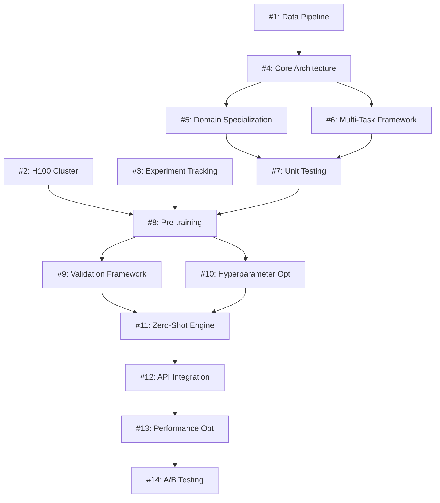

# GitHub Issues: ATS Foundation Transformer Implementation

## Epic: ATS Foundation Transformer Development

**Epic Description**: Implement state-of-the-art foundation model architecture for multi-horizon financial forecasting with zero-shot inference capabilities, building upon existing TFT infrastructure.

**Timeline**: 18 weeks (Q1-Q2 2025)  
**Assignee**: AI/ML Team  
**Priority**: High  
**Labels**: `epic`, `foundation-model`, `transformer`, `ml-platform`

---

## Phase 1: Infrastructure Setup (Weeks 1-2)

### Issue #1: Multi-Resolution Data Pipeline Enhancement
**Title**: Extend file-based storage system for 8K sequence length processing

**Description**:
Enhance the existing file-based storage system to support foundation model training requirements with 8,192 token sequences (68x increase from current 120 tokens).

**Tasks**:
- [ ] Modify `FileBasedMinuteDataManager` to handle 8K sequence lengths
- [ ] Update data sharding strategy for massive scale (500M+ sequences)
- [ ] Implement cross-timeframe data alignment for 5min/15min/1hour/daily
- [ ] Add unified sequence generation (S3 format) capabilities
- [ ] Performance testing: ensure <50ms query times maintained at scale

**Acceptance Criteria**:
- [ ] System processes 8,192 token sequences without memory issues
- [ ] Cross-timeframe alignment maintains <1 minute precision
- [ ] Query performance <50ms for foundation model training data
- [ ] Backward compatibility with existing 120-token TFT system

**Priority**: High  
**Assignee**: Data Infrastructure Team  
**Labels**: `data-pipeline`, `storage`, `performance`  
**Estimated Effort**: 5 days

---

### Issue #2: H100 Training Cluster Setup
**Title**: Configure H100 cluster with DeepSpeed ZeRO-3 for foundation model pre-training

**Description**:
Set up high-performance training infrastructure capable of training 200M parameter model on 500M+ sequences over 2 months.

**Tasks**:
- [ ] Provision H100 cluster (8 nodes minimum)
- [ ] Install and configure DeepSpeed ZeRO-3 for model sharding
- [ ] Set up distributed training with gradient accumulation
- [ ] Configure monitoring and logging for long-running training jobs
- [ ] Test training pipeline with small-scale model

**Acceptance Criteria**:
- [ ] H100 cluster operational with >95% uptime
- [ ] DeepSpeed ZeRO-3 successfully shards 200M parameter model
- [ ] Distributed training achieves >80% GPU utilization
- [ ] Comprehensive monitoring captures training metrics

**Priority**: High  
**Assignee**: DevOps/Infrastructure Team  
**Labels**: `infrastructure`, `training-cluster`, `deepspeed`  
**Estimated Effort**: 8 days

---

### Issue #3: Foundation Model Experiment Tracking
**Title**: Enhanced MLflow integration for foundation model experiments

**Description**:
Extend existing experiment tracking to handle foundation model scale experiments with comprehensive metric collection and model versioning.

**Tasks**:
- [ ] Enhanced MLflow server configuration for large model artifacts
- [ ] Foundation model specific metric tracking (perplexity, loss curves, etc.)
- [ ] Model checkpoint versioning with automatic rollback capabilities
- [ ] Integration with existing `TFTTrainingPipeline` infrastructure
- [ ] Distributed experiment logging across training cluster

**Acceptance Criteria**:
- [ ] MLflow handles 200M+ parameter model artifacts
- [ ] Foundation model metrics properly tracked and visualized
- [ ] Model versioning supports incremental checkpoints
- [ ] Seamless integration with existing experiment workflows

**Priority**: Medium  
**Assignee**: ML Infrastructure Team  
**Labels**: `mlops`, `experiment-tracking`, `mlflow`  
**Estimated Effort**: 3 days

---

## Phase 2: Model Development (Weeks 3-6)

### Issue #4: Core Foundation Transformer Architecture
**Title**: Implement ATSFoundationTransformer with multi-resolution processing

**Description**:
Develop the core transformer architecture with financial domain specializations, building upon existing TFT codebase.

**Tasks**:
- [ ] Implement `ATSFoundationTransformer` class extending existing TFT architecture
- [ ] Create multi-resolution encoders for 5min/15min/1hour/daily timeframes
- [ ] Develop cross-timeframe fusion layer with attention mechanisms
- [ ] Integrate with existing sentiment analysis features
- [ ] Add positional encoding for multi-timeframe sequences

**Acceptance Criteria**:
- [ ] Model handles 8,192 token sequences with multi-timeframe data
- [ ] Cross-timeframe attention properly weights different time horizons
- [ ] Model architecture maintains compatibility with existing TFT interfaces
- [ ] Memory usage <32GB for 200M parameter model during inference

**Priority**: High  
**Assignee**: ML Architecture Team  
**Labels**: `architecture`, `transformer`, `multi-timeframe`  
**Estimated Effort**: 10 days

---

### Issue #5: Financial Domain Specialization Components
**Title**: Implement Smart Money Zone attention and Support/Resistance encoders

**Description**:
Develop specialized transformer components for financial domain knowledge, integrating with existing Smart Money Zone detection systems.

**Tasks**:
- [ ] Implement `SmartMoneyAttention` module with volume profile analysis
- [ ] Create `SupportResistanceEncoder` with pivot point detection
- [ ] Develop `BlockTradeDetector` and `DarkPoolEstimator` components  
- [ ] Integrate with existing `SmartMoneyZoneDetector` infrastructure
- [ ] Add financial pattern recognition layers (Fibonacci, psychological levels)

**Acceptance Criteria**:
- [ ] Smart Money attention identifies institutional activity with >80% accuracy
- [ ] Support/Resistance encoder detects key levels within 0.5% precision
- [ ] Components integrate seamlessly with existing Smart Money infrastructure
- [ ] Financial domain knowledge improves baseline transformer performance by >5%

**Priority**: High  
**Assignee**: Quantitative Research Team  
**Labels**: `domain-knowledge`, `smart-money`, `support-resistance`  
**Estimated Effort**: 12 days

---

### Issue #6: Multi-Task Learning Framework
**Title**: Develop multi-task training objectives for financial forecasting

**Description**:
Implement comprehensive multi-task learning framework with financial domain-specific objectives.

**Tasks**:
- [ ] Implement `MaskedPricePrediction` objective (30% weight)
- [ ] Create `NextCandlePrediction` with directional accuracy (25% weight)
- [ ] Develop `CrossTimeframeConsistency` loss function (20% weight)
- [ ] Add `SmartMoneyDetection` binary classification (15% weight)
- [ ] Implement `SupportResistancePrediction` level proximity loss (10% weight)

**Acceptance Criteria**:
- [ ] Multi-task framework balances all 5 objectives effectively
- [ ] Individual task performance meets minimum thresholds
- [ ] Combined loss function converges stably during training
- [ ] Task weighting can be adjusted via configuration

**Priority**: High  
**Assignee**: ML Research Team  
**Labels**: `multi-task`, `loss-functions`, `training-objectives`  
**Estimated Effort**: 8 days

---

### Issue #7: Comprehensive Unit Testing Suite
**Title**: Full test coverage for foundation model components

**Description**:
Develop comprehensive test suite ensuring reliability and correctness of all foundation model components.

**Tasks**:
- [ ] Unit tests for `ATSFoundationTransformer` architecture
- [ ] Tests for multi-resolution data processing
- [ ] Financial domain component testing (Smart Money, S&R)
- [ ] Multi-task learning objective validation
- [ ] Integration tests with existing TFT infrastructure
- [ ] Performance benchmark tests

**Acceptance Criteria**:
- [ ] >95% test coverage for all foundation model code
- [ ] All tests pass in CI/CD pipeline
- [ ] Performance benchmarks validate latency requirements
- [ ] Integration tests confirm backward compatibility

**Priority**: Medium  
**Assignee**: ML Engineering Team  
**Labels**: `testing`, `unit-tests`, `integration-tests`  
**Estimated Effort**: 6 days

---

## Phase 3: Pre-training (Weeks 7-14)

### Issue #8: Foundation Model Pre-training Pipeline
**Title**: Execute 2-month pre-training on 500M+ sequences

**Description**:
Run the foundation model pre-training process on the complete ATS dataset (30 years, 4,000 instruments) with comprehensive monitoring and checkpointing.

**Tasks**:
- [ ] Configure training pipeline for 500M+ sequence dataset
- [ ] Implement curriculum learning strategy (simple → complex patterns)
- [ ] Set up automated checkpointing every 24 hours
- [ ] Configure distributed training across H100 cluster
- [ ] Implement training resumption from checkpoints
- [ ] Real-time training metrics monitoring

**Acceptance Criteria**:
- [ ] Training completes successfully within 2 month timeline
- [ ] Model achieves convergence on validation set
- [ ] Training process maintains >90% GPU utilization
- [ ] Comprehensive training metrics collected and logged
- [ ] Final model checkpoints saved and validated

**Priority**: High  
**Assignee**: ML Training Team  
**Labels**: `pre-training`, `distributed-training`, `monitoring`  
**Estimated Effort**: 60 days (automated process)

---

### Issue #9: Continuous Validation Framework
**Title**: Real-time validation during foundation model training

**Description**:
Implement continuous validation system to monitor training progress and detect issues early.

**Tasks**:
- [ ] Design held-out validation sets across different market regimes
- [ ] Implement real-time evaluation metrics calculation
- [ ] Create automated alerting for training anomalies
- [ ] Develop early stopping criteria based on validation performance
- [ ] Build validation dashboard for training monitoring

**Acceptance Criteria**:
- [ ] Validation runs automatically every 4 hours during training
- [ ] Alerts trigger for loss spikes or training instabilities
- [ ] Dashboard provides real-time training insights
- [ ] Early stopping prevents overfitting or divergence

**Priority**: Medium  
**Assignee**: ML Monitoring Team  
**Labels**: `validation`, `monitoring`, `alerting`  
**Estimated Effort**: 5 days

---

### Issue #10: Hyperparameter Optimization
**Title**: Automated tuning for optimal foundation model performance

**Description**:
Implement systematic hyperparameter optimization to maximize foundation model performance.

**Tasks**:
- [ ] Design parameter search space (learning rate, architecture sizes, etc.)
- [ ] Implement Bayesian optimization for efficient search
- [ ] Create parallel training for hyperparameter exploration
- [ ] Develop performance evaluation metrics for parameter selection
- [ ] Document optimal hyperparameter configurations

**Acceptance Criteria**:
- [ ] Hyperparameter search completes within training timeline
- [ ] Optimal parameters improve validation performance by >3%
- [ ] Parameter sensitivity analysis documented
- [ ] Final hyperparameter config saved and reproducible

**Priority**: Medium  
**Assignee**: ML Research Team  
**Labels**: `hyperparameter-optimization`, `bayesian-optimization`  
**Estimated Effort**: 10 days

---

## Phase 4: Integration & Deployment (Weeks 15-18)

### Issue #11: Zero-Shot Inference Engine
**Title**: Implement zero-shot prediction capabilities for unseen instruments

**Description**:
Develop zero-shot inference system enabling predictions on instruments not seen during training.

**Tasks**:
- [ ] Implement `ZeroShotInferenceEngine` with instrument embedding
- [ ] Create `InstrumentEmbedder` based on market characteristics
- [ ] Develop `MarketRegimeDetector` for context adaptation
- [ ] Build confidence scoring for zero-shot predictions
- [ ] Create explanation generation for prediction interpretability

**Acceptance Criteria**:
- [ ] Zero-shot predictions achieve >70% accuracy on unseen instruments
- [ ] Inference latency <50ms for single instrument prediction
- [ ] Confidence scores correlate with actual prediction accuracy
- [ ] System handles 4,000 instruments simultaneously

**Priority**: High  
**Assignee**: ML Engineering Team  
**Labels**: `zero-shot`, `inference-engine`, `embeddings`  
**Estimated Effort**: 8 days

---

### Issue #12: API Integration and Backward Compatibility
**Title**: Seamless integration with existing TFT endpoints

**Description**:
Ensure foundation model integrates seamlessly with existing TFT-based systems without breaking changes.

**Tasks**:
- [ ] Implement `ATSTFTCompatibilityLayer` for API compatibility
- [ ] Create request/response format converters
- [ ] Add feature flag system for gradual rollout
- [ ] Develop fallback mechanism to legacy TFT if needed
- [ ] Update API documentation with foundation model endpoints

**Acceptance Criteria**:
- [ ] Existing TFT API consumers work without code changes
- [ ] Feature flags enable A/B testing between TFT and foundation model
- [ ] Fallback system provides 99.9% availability
- [ ] API response times maintain <100ms SLA

**Priority**: High  
**Assignee**: API/Backend Team  
**Labels**: `api-integration`, `backward-compatibility`, `feature-flags`  
**Estimated Effort**: 6 days

---

### Issue #13: Production Performance Optimization
**Title**: Optimize foundation model for production inference requirements

**Description**:
Optimize foundation model for production deployment with focus on latency and throughput.

**Tasks**:
- [ ] Implement model quantization for inference acceleration
- [ ] Add batch prediction capabilities for multiple instruments
- [ ] Optimize memory usage with model pruning techniques
- [ ] Implement caching for frequently requested predictions
- [ ] Add GPU memory management for concurrent requests

**Acceptance Criteria**:
- [ ] Inference latency <50ms for single prediction
- [ ] System handles 4,000 concurrent predictions
- [ ] Memory usage optimized for production deployment
- [ ] Throughput >1000 predictions/second

**Priority**: High  
**Assignee**: ML Engineering Team  
**Labels**: `performance-optimization`, `inference`, `production`  
**Estimated Effort**: 7 days

---

### Issue #14: A/B Testing Framework
**Title**: Gradual rollout with performance comparison against existing TFT

**Description**:
Implement comprehensive A/B testing framework to validate foundation model performance against existing TFT system.

**Tasks**:
- [ ] Design A/B test strategy with traffic splitting
- [ ] Implement statistical significance testing
- [ ] Create performance comparison dashboard
- [ ] Develop automated rollback mechanisms
- [ ] Set up business impact measurement

**Acceptance Criteria**:
- [ ] A/B test runs successfully with configurable traffic split
- [ ] Statistical significance calculated automatically
- [ ] Performance comparison shows foundation model advantages
- [ ] Rollback capability ensures system stability

**Priority**: Medium  
**Assignee**: ML Engineering Team  
**Labels**: `ab-testing`, `validation`, `rollout`  
**Estimated Effort**: 5 days

---

## Additional Issues for Future Enhancement

### Issue #15: Cross-Asset Foundation Model
**Title**: Extend foundation model to multi-asset classes (bonds, forex, commodities)

**Description**: Expand foundation model capabilities beyond equities to include bonds, forex, and commodities for comprehensive cross-asset analysis.

**Priority**: Low  
**Labels**: `future-enhancement`, `multi-asset`

### Issue #16: Real-Time Foundation Model Updates
**Title**: Implement incremental learning for real-time model updates

**Description**: Enable foundation model to learn from new market data in real-time without full retraining.

**Priority**: Low  
**Labels**: `future-enhancement`, `incremental-learning`

### Issue #17: Foundation Model Interpretability
**Title**: Enhanced interpretability tools for foundation model decisions

**Description**: Develop comprehensive interpretability tools to understand foundation model predictions and decision-making process.

**Priority**: Medium  
**Labels**: `interpretability`, `explainability`

---

## Issue Dependencies

## Success Metrics per Phase

### Phase 1 Success Criteria:
- [ ] Data pipeline processes 8K sequences <50ms
- [ ] H100 cluster achieves >90% GPU utilization
- [ ] Experiment tracking handles foundation model scale

### Phase 2 Success Criteria:
- [ ] Foundation model architecture functional with multi-timeframe data
- [ ] Financial domain components improve baseline performance >5%
- [ ] >95% unit test coverage achieved

### Phase 3 Success Criteria:
- [ ] Pre-training completes within 2-month timeline
- [ ] Model achieves >75% accuracy on validation set
- [ ] Training process maintains stability throughout

### Phase 4 Success Criteria:
- [ ] Zero-shot inference achieves >70% accuracy on unseen instruments
- [ ] Production inference <50ms latency for 4,000 instruments
- [ ] A/B testing demonstrates foundation model advantages

---

**Total Estimated Effort**: 142 developer days across 18 weeks  
**Team Size**: 8-10 engineers across ML, Infrastructure, and Backend teams  
**Risk Buffer**: 20% additional time allocated for unexpected challenges  
**Go-Live Target**: Q2 2025