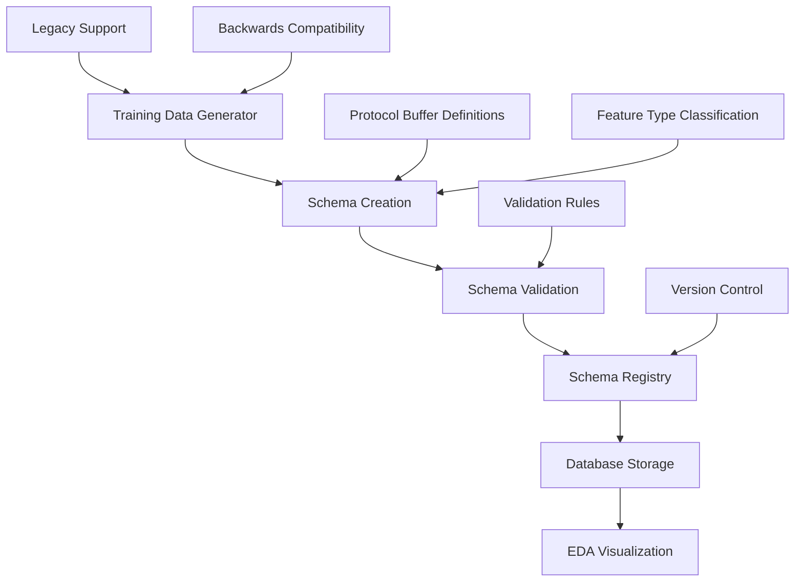

# Training Dataset Schema Management

## Overview

The ATS Training Dataset Schema Management System provides comprehensive schema definitions, validation, and lifecycle management for machine learning training datasets in the ATS platform. This system ensures data quality, enables schema evolution, and facilitates seamless integration with EDA visualization and model training pipelines.

## Table of Contents

1. [Architecture Overview](#architecture-overview)
2. [Core Components](#core-components) 
3. [Schema Definitions](#schema-definitions)
4. [Database Integration](#database-integration)
5. [Training Pipeline Integration](#training-pipeline-integration)
6. [EDA Integration](#eda-integration)
7. [API Reference](#api-reference)
8. [Usage Examples](#usage-examples)
9. [Best Practices](#best-practices)
10. [Migration Guide](#migration-guide)

## Architecture Overview



The schema management system follows a layered architecture:

- **Schema Definition Layer**: Protocol Buffer inspired schemas with Python dataclasses
- **Validation Layer**: Comprehensive data validation and quality scoring
- **Registry Layer**: Version control and schema lifecycle management  
- **Storage Layer**: PostgreSQL JSONB storage with query optimization
- **Integration Layer**: Seamless integration with training and EDA systems

## Core Components

### 1. Schema Classes (`src/schema/training_schema.py`)

#### TrainingDatasetSchema
Main schema class containing complete dataset definition:

```python
@dataclass
class TrainingDatasetSchema:
    schema_version: str              # Schema version (semantic versioning)
    dataset_name: str                # Unique dataset identifier
    dataset_description: str         # Human-readable description
    features: List[FeatureSchema]    # Feature specifications
    labels: List[LabelSchema]        # Label specifications  
    metadata: DatasetMetadata        # Dataset metadata
    tfdv_stats: TFDVStatistics      # TensorFlow Data Validation stats
    created_by: str                  # Creator information
    compatibility: SchemaCompatibility  # Version compatibility info
```

#### FeatureSchema
Individual feature definition with financial ML optimizations:

```python
@dataclass
class FeatureSchema:
    name: str                        # Feature name
    type: FeatureType               # Feature type classification
    data_type: DataType             # Underlying data type
    shape: List[int]                # Shape dimensions
    description: str                # Human-readable description
    constraints: FeatureConstraints # Validation rules
    metadata: Dict[str, Any]        # Additional metadata
    visualization_type: VisualizationType  # EDA visualization hint
    timeframe: TimeframeSpec        # Timeframe information
    source_column: str              # Original data source
    dependencies: List[str]         # Feature dependencies
```

### 2. Feature Type Classification

Financial-specific feature types for optimal ML pipeline integration:

```python
class FeatureType(Enum):
    # Basic price data
    OHLC_INTERVALS = "ohlc_intervals"              # OHLC price matrices
    PRICE_SERIES = "price_series"                  # Single price series
    VOLUME_SERIES = "volume_series"                # Volume series
    
    # Technical indicators  
    TECHNICAL_INDICATOR = "technical_indicator"     # Technical indicators
    PRICE_INDICATOR_INTERVALS = "price_indicator_intervals"
    VOLUME_INDICATOR_INTERVALS = "volume_indicator_intervals"
    CROSS_TIMEFRAME_INDICATORS = "cross_timeframe_indicators"
    
    # Derived features
    RETURN_SERIES = "return_series"                # Return calculations
    VOLATILITY_SERIES = "volatility_series"       # Volatility measurements  
    MOMENTUM_SERIES = "momentum_series"            # Momentum indicators
    
    # Market context
    MARKET_REGIME_INDICATORS = "market_regime_indicators"
    RELATIVE_STRENGTH_INDICATORS = "relative_strength_indicators" 
    SEASONAL_INDICATORS = "seasonal_indicators"
    
    # Labels
    CLASSIFICATION_LABEL = "classification_label"
    REGRESSION_LABEL = "regression_label"
    MULTI_HORIZON_LABEL = "multi_horizon_label"
```

### 3. Data Validation (`ValidationResult`)

Comprehensive validation with financial ML best practices:

```python
@dataclass
class ValidationResult:
    is_valid: bool                   # Overall validation status
    errors: List[ValidationError]    # Critical validation errors
    warnings: List[ValidationWarning]  # Non-critical warnings
    confidence_score: float          # Data quality confidence (0-1)
    validation_timestamp: str        # Validation timestamp
```

## Database Integration

### Schema Storage

The system uses PostgreSQL JSONB columns for efficient schema storage and querying:

```sql
-- Enhanced training datasets table
ALTER TABLE dev_training_datasets 
ADD COLUMN schema_hash VARCHAR(64),
ADD COLUMN schema_version VARCHAR(50) DEFAULT '1.0.0',
ADD COLUMN schema_json JSONB DEFAULT '{}',
ADD COLUMN feature_schema JSONB DEFAULT '{}',
ADD COLUMN label_schema JSONB DEFAULT '{}',
ADD COLUMN validation_results JSONB DEFAULT '{}';

-- Schema registry table
CREATE TABLE dev_training_schema_registry (
    id SERIAL PRIMARY KEY,
    schema_name VARCHAR(255) NOT NULL,
    schema_version VARCHAR(50) NOT NULL, 
    schema_hash VARCHAR(64) NOT NULL,
    schema_json JSONB NOT NULL,
    created_at TIMESTAMP DEFAULT NOW(),
    created_by VARCHAR(255),
    tags TEXT[],
    description TEXT,
    status VARCHAR(50) DEFAULT 'active',
    usage_count INTEGER DEFAULT 0,
    last_used_at TIMESTAMP,
    UNIQUE(schema_name, schema_version)
);
```

### Schema Registry DAO (`src/dao/training_schema_dao.py`)

Database access layer with comprehensive CRUD operations:

```python
class TrainingSchemaDAO:
    async def register_schema(self, schema: TrainingDatasetSchema, 
                            created_by: str, tags: List[str], 
                            description: str) -> str
    
    async def get_schema_by_hash(self, schema_hash: str) -> Optional[TrainingDatasetSchema]
    
    async def get_schema_by_name_version(self, schema_name: str, 
                                       version: str = "latest") -> Optional[TrainingDatasetSchema]
    
    async def list_schemas(self, tags: Optional[List[str]] = None,
                          status: str = "active", limit: int = 50) -> List[Dict]
    
    async def find_compatible_schemas(self, feature_count: int,
                                    sequence_length: int, 
                                    symbol: Optional[str] = None) -> List[Dict]
```

## Training Pipeline Integration

### Enhanced Training Data Generator

The existing `ResidualReturnTrainingDataGenerator` has been enhanced with schema management:

```python
# Schema-aware training data generation
result = await generator.generate_training_dataset(
    start_date=datetime(2023, 6, 1),
    end_date=datetime(2023, 6, 30),
    instrument_ids=[1, 2, 3],
    include_schema=True,  # Enable schema management
    output_path="/path/to/dataset"
)

# Result includes comprehensive schema information
assert isinstance(result.schema, TrainingDatasetSchema)
assert result.validation_result.is_valid
assert result.features_array.shape[1] == len(result.schema.features)
```

### Automatic Schema Creation

The system automatically creates schemas by analyzing training data:

1. **Feature Type Inference**: Automatically classifies features by column names
2. **Statistical Analysis**: Computes feature statistics for validation
3. **Validation**: Validates data against schema constraints
4. **Registration**: Registers schema in database registry

### Backwards Compatibility

Legacy training code continues to work unchanged:

```python
# Legacy mode - returns DataFrame
result = await generator.generate_training_dataset(
    start_date, end_date, instrument_ids, 
    include_schema=False  # Disable schema management
)
dataframe = result.metadata['dataframe']  # Access legacy DataFrame
```

## EDA Integration

### Schema-Aware Visualization

EDA system uses schema metadata for intelligent visualization:

```python
# Feature categorization based on schema
def categorize_features_by_type(schema):
    categories = {
        'technical_indicators': [],
        'return_features': [], 
        'volume_features': [],
        'volatility_features': []
    }
    
    for feature in schema.features:
        if feature.type == FeatureType.TECHNICAL_INDICATOR:
            categories['technical_indicators'].append(feature.name)
        elif feature.type == FeatureType.RETURN_SERIES:
            categories['return_features'].append(feature.name)
        # ... additional categorization
    
    return categories
```

### Visualization Recommendations

Schema includes visualization type hints:

```python
# Automatic visualization selection
visualization_mapping = {
    FeatureType.TECHNICAL_INDICATOR: ['line_chart', 'candlestick_overlay'],
    FeatureType.RETURN_SERIES: ['histogram', 'qq_plot', 'rolling_statistics'],
    FeatureType.VOLUME_SERIES: ['bar_chart', 'volume_profile', 'box_plot'],
    FeatureType.VOLATILITY_SERIES: ['line_chart', 'heatmap', 'box_plot'],
    FeatureType.MARKET_REGIME_INDICATORS: ['categorical_plot', 'regime_timeline']
}
```

### Data Quality Dashboard

Integration with schema validation results:

```python
def create_data_quality_dashboard(schema, validation):
    return {
        'overall_quality': {
            'score': validation.confidence_score,
            'is_valid': validation.is_valid
        },
        'quality_metrics': {
            'error_count': len(validation.errors),
            'warning_count': len(validation.warnings),
            'schema_compliance': validation.is_valid
        },
        'schema_info': {
            'version': schema.schema_version,
            'feature_count': len(schema.features),
            'label_count': len(schema.labels)
        }
    }
```

## API Reference

### Core Schema Operations

#### Creating Schemas

```python
from src.schema.training_schema import TrainingDatasetSchema, FeatureSchema, DataType, FeatureType

# Manual schema creation
schema = TrainingDatasetSchema(
    schema_version="1.0.0",
    dataset_name="aapl_daily_returns",
    features=[
        FeatureSchema(
            name="sma_20",
            type=FeatureType.TECHNICAL_INDICATOR,
            data_type=DataType.FLOAT32,
            shape=[60, 1],
            description="20-period Simple Moving Average"
        )
    ]
)

# Factory functions for common patterns
from src.schema.training_schema import create_ohlcv_schema, create_multi_horizon_schema

ohlcv_schema = create_ohlcv_schema(
    dataset_name="standard_ohlcv_60d",
    symbol="AAPL",
    sequence_length=60,
    include_volume=True,
    technical_indicators=["sma_10", "sma_20", "rsi_14", "macd"]
)

multi_horizon_schema = create_multi_horizon_schema(
    dataset_name="multi_horizon_prediction",
    symbol="AAPL", 
    horizons=[1, 3, 5, 10],
    sequence_length=60
)
```

#### Schema Registry Operations

```python
from src.dao.training_schema_dao import TrainingSchemaDAO

dao = TrainingSchemaDAO(environment)

# Register schema
schema_hash = await dao.register_schema(
    schema,
    created_by="ML Engineer",
    tags=["AAPL", "daily", "technical_analysis"],
    description="AAPL daily returns with technical indicators"
)

# Retrieve schema
retrieved_schema = await dao.get_schema_by_hash(schema_hash)
latest_schema = await dao.get_schema_by_name_version("aapl_daily_returns", "latest")

# Find compatible schemas
compatible = await dao.find_compatible_schemas(
    feature_count=25,
    sequence_length=60, 
    symbol="AAPL"
)
```

#### Training Data Generation

```python
from src.modeling.training_data_generator import generate_residual_return_training_data

# Schema-aware generation
result = await generate_residual_return_training_data(
    connection_pool=pool,
    env=environment,
    universe_state_manager=universe_manager,
    start_date=datetime(2023, 1, 1),
    end_date=datetime(2023, 12, 31),
    instrument_ids=[1, 2, 3],
    include_schema=True,
    output_path="/data/training/run_123"
)

# Access results
features = result.features_array      # NumPy array
labels = result.labels_array         # NumPy array  
schema = result.schema              # TrainingDatasetSchema
validation = result.validation_result  # ValidationResult
```

### Validation Operations

```python
# Validate training data against schema
validation_result = generator._validate_training_data(
    schema, features_array, labels_array
)

if not validation_result.is_valid:
    print("Validation errors:")
    for error in validation_result.errors:
        print(f"  - {error}")
        
if validation_result.warnings:
    print("Validation warnings:")
    for warning in validation_result.warnings:
        print(f"  - {warning}")

print(f"Confidence score: {validation_result.confidence_score:.2f}")
```

## Usage Examples

### Example 1: Creating a Complete OHLCV Schema

```python
import asyncio
from datetime import datetime
from src.schema.training_schema import create_ohlcv_schema
from src.dao.training_schema_dao import TrainingSchemaDAO, create_schema_dao

async def create_aapl_schema():
    # Create comprehensive OHLCV schema
    schema = create_ohlcv_schema(
        dataset_name="aapl_ohlcv_comprehensive",
        symbol="AAPL",
        sequence_length=60,
        include_volume=True,
        technical_indicators=[
            "sma_10", "sma_20", "sma_50",
            "ema_12", "ema_26", 
            "rsi_14", "macd", "bb_upper", "bb_lower"
        ]
    )
    
    # Register in database
    dao = await create_schema_dao('dev')
    schema_hash = await dao.register_schema(
        schema,
        created_by="Data Science Team",
        tags=["AAPL", "OHLCV", "comprehensive", "technical_analysis"],
        description="Comprehensive AAPL OHLCV schema with 9 technical indicators"
    )
    
    print(f"Schema registered with hash: {schema_hash}")
    return schema_hash

# Run example
schema_hash = asyncio.run(create_aapl_schema())
```

### Example 2: Schema-Aware Training Data Generation

```python
async def generate_validated_training_data():
    from src.modeling.training_data_generator import generate_residual_return_training_data
    
    # Generate with automatic schema creation and validation
    result = await generate_residual_return_training_data(
        connection_pool=db_pool,
        env=dev_environment,
        universe_state_manager=universe_manager,
        start_date=datetime(2023, 1, 1),
        end_date=datetime(2023, 6, 30),
        instrument_ids=[1, 2, 3],  # AAPL, MSFT, GOOGL
        include_schema=True,
        output_path="/data/training/residual_returns_2023_h1"
    )
    
    # Validate results
    print(f"Generated dataset: {result.dataset_path}")
    print(f"Features shape: {result.features_array.shape}")
    print(f"Labels shape: {result.labels_array.shape}")
    print(f"Schema version: {result.schema.schema_version}")
    print(f"Validation status: {'VALID' if result.validation_result.is_valid else 'INVALID'}")
    print(f"Confidence score: {result.validation_result.confidence_score:.3f}")
    
    # Schema information
    print(f"\\nFeature types:")
    for feature in result.schema.features:
        print(f"  - {feature.name}: {feature.type.value}")
    
    return result

# Run example  
training_result = asyncio.run(generate_validated_training_data())
```

### Example 3: EDA Integration with Schema

```python
def create_schema_aware_eda_config(schema):
    \"\"\"Create EDA configuration using schema metadata.\"\"\"
    
    # Group features by type
    feature_groups = {}
    for feature in schema.features:
        feature_type = feature.type.value
        if feature_type not in feature_groups:
            feature_groups[feature_type] = []
        feature_groups[feature_type].append({
            'name': feature.name,
            'description': feature.description,
            'visualization_type': feature.visualization_type.value
        })
    
    # Generate EDA configuration
    eda_config = {
        'dataset_info': {
            'name': schema.dataset_name,
            'symbol': schema.metadata.symbol,
            'timeframe': schema.metadata.base_timeframe,
            'sequence_length': schema.metadata.sequence_length
        },
        'feature_groups': feature_groups,
        'default_views': []
    }
    
    # Add default views based on feature types
    if 'technical_indicator' in feature_groups:
        eda_config['default_views'].append({
            'name': 'Technical Indicators',
            'type': 'multi_line_chart',
            'features': [f['name'] for f in feature_groups['technical_indicator']]
        })
    
    if 'return_series' in feature_groups:
        eda_config['default_views'].append({
            'name': 'Returns Distribution',
            'type': 'histogram_grid', 
            'features': [f['name'] for f in feature_groups['return_series']]
        })
    
    return eda_config

# Usage with training result
eda_config = create_schema_aware_eda_config(training_result.schema)
print("EDA configuration generated with schema awareness")
```

### Example 4: Schema Evolution and Compatibility

```python
async def demonstrate_schema_evolution():
    dao = await create_schema_dao('dev')
    
    # Create v1.0 schema
    schema_v1 = create_ohlcv_schema(
        dataset_name="aapl_evolution_demo",
        symbol="AAPL",
        sequence_length=60,
        technical_indicators=["sma_20", "rsi_14"]
    )
    schema_v1.schema_version = "1.0.0"
    
    # Register v1.0
    hash_v1 = await dao.register_schema(
        schema_v1,
        created_by="ML Team",
        tags=["AAPL", "v1"],
        description="Initial AAPL schema with basic indicators"
    )
    
    # Create v1.1 schema (backward compatible - added features)
    schema_v11 = create_ohlcv_schema(
        dataset_name="aapl_evolution_demo", 
        symbol="AAPL",
        sequence_length=60,
        technical_indicators=["sma_20", "rsi_14", "macd", "bb_upper", "bb_lower"]
    )
    schema_v11.schema_version = "1.1.0"
    
    # Register v1.1
    hash_v11 = await dao.register_schema(
        schema_v11,
        created_by="ML Team",
        tags=["AAPL", "v1.1", "enhanced"],
        description="Enhanced AAPL schema with MACD and Bollinger Bands"
    )
    
    # Demonstrate compatibility checking
    schemas = await dao.list_schemas(tags=["AAPL"], limit=10)
    print(f"Found {len(schemas)} AAPL schemas:")
    for schema_info in schemas:
        print(f"  - {schema_info['schema_name']} v{schema_info['schema_version']}")
    
    return hash_v1, hash_v11

# Run evolution demo
v1_hash, v11_hash = asyncio.run(demonstrate_schema_evolution())
```

## Best Practices

### 1. Schema Design Principles

**Semantic Versioning**: Use semantic versioning for schema versions:
- `MAJOR.MINOR.PATCH`
- Major: Breaking changes (removed features, changed data types)
- Minor: Backward compatible additions (new features)
- Patch: Bug fixes, documentation updates

**Descriptive Naming**: Use clear, descriptive names for features and datasets:
```python
# Good
"aapl_daily_ohlcv_with_technical_indicators"

# Bad  
"dataset_1" 
```

**Feature Classification**: Always specify appropriate feature types:
```python
# Correct feature typing
FeatureSchema(
    name="sma_20",
    type=FeatureType.TECHNICAL_INDICATOR,  # Specific classification
    data_type=DataType.FLOAT32
)
```

### 2. Validation Best Practices

**Set Appropriate Constraints**: Define reasonable validation constraints:
```python
FeatureConstraints(
    min_value=0.0,        # Stock prices can't be negative
    max_value=10000.0,    # Reasonable upper bound
    required=True,        # Critical features should be required
    min_fraction=0.8      # Allow some missing data
)
```

**Quality Score Thresholds**: Define quality score thresholds:
- `>= 0.95`: Excellent data quality, ready for production
- `>= 0.85`: Good quality, suitable for training
- `>= 0.7`: Acceptable quality, may need review
- `< 0.7`: Poor quality, requires attention

### 3. Performance Optimization

**Batch Schema Operations**: Register multiple schemas in batches:
```python
# Efficient batch registration
schemas_to_register = [schema1, schema2, schema3]
for schema in schemas_to_register:
    await dao.register_schema(schema, ...)
```

**Use Schema Hashing**: Leverage schema hashing for duplicate detection:
```python
# Check for existing schema before registration
existing_schema = await dao.get_schema_by_hash(new_schema.get_schema_hash())
if existing_schema:
    print("Schema already exists, skipping registration")
```

**Optimize Database Queries**: Use appropriate indexes and query patterns:
```sql
-- Efficient schema lookup by tags
CREATE INDEX idx_schema_registry_tags ON dev_training_schema_registry USING GIN(tags);

-- Efficient lookup by usage
CREATE INDEX idx_schema_registry_usage ON dev_training_schema_registry(usage_count DESC, last_used_at DESC);
```

### 4. Integration Guidelines

**EDA Integration**: Always include visualization hints:
```python
FeatureSchema(
    name="macd_signal",
    type=FeatureType.TECHNICAL_INDICATOR,
    visualization_type=VisualizationType.DUAL_AXIS,  # Hint for EDA
    metadata={
        'recommended_plots': ['line_chart', 'signal_overlay'],
        'color_scheme': 'diverging'
    }
)
```

**Training Pipeline Integration**: Design schemas for ML pipeline compatibility:
```python
# Ensure consistent shapes for ML models
for feature in schema.features:
    assert len(feature.shape) == 2  # [time_steps, feature_dims]
    assert feature.shape[0] == sequence_length  # Consistent sequence length
```

## Migration Guide

### Migrating from Legacy Training Data

#### Step 1: Database Migration

```bash
# Apply database migration
python scripts/apply_schema_migration.py
```

#### Step 2: Update Training Code

```python
# Before (Legacy)
training_df = await generator.generate_training_dataset(
    start_date, end_date, instrument_ids
)

# After (Schema-aware)
training_result = await generator.generate_training_dataset(
    start_date, end_date, instrument_ids,
    include_schema=True,
    output_path="/data/training/run_001"
)

# Access legacy DataFrame if needed
training_df = training_result.metadata.get('dataframe')
```

#### Step 3: Update EDA Code

```python
# Before (Manual configuration)
eda_config = {
    'features': ['sma_20', 'rsi_14', 'return_1d'],
    'plots': ['line', 'histogram']
}

# After (Schema-driven configuration)
eda_config = create_schema_aware_eda_config(training_result.schema)
```

#### Step 4: Register Existing Schemas

```python
# Create schemas for existing datasets
for dataset in existing_datasets:
    schema = infer_schema_from_dataset(dataset)
    await dao.register_schema(
        schema,
        created_by="Migration Script",
        tags=["legacy", "migrated"],
        description=f"Migrated schema for {dataset.name}"
    )
```

### Backwards Compatibility

The system maintains full backwards compatibility:

```python
# Legacy code continues to work unchanged
old_result = await generator.generate_training_dataset(
    start_date, end_date, instrument_ids,
    include_schema=False  # Explicitly disable schema features
)

# Returns TrainingDatasetResult with DataFrame in metadata
legacy_dataframe = old_result.metadata['dataframe']
```

## Testing

### Unit Tests

```bash
# Run schema component tests  
PYTHONPATH=src python3 -m pytest tests/unit/test_training_schema_components.py -v

# Run integration tests
PYTHONPATH=src python3 -m pytest tests/integration/test_schema_aware_training_generation.py -v

# Run EDA integration tests
PYTHONPATH=src python3 -m pytest tests/integration/test_schema_eda_integration.py -v
```

### Manual Testing

```bash
# Run implementation verification
python3 scripts/run_dev.py run --script test_schema_implementation.py
```

## Troubleshooting

### Common Issues

**Schema Hash Mismatch**:
```python
# Ensure consistent serialization order
schema_dict = schema.to_dict()
canonical_json = json.dumps(schema_dict, sort_keys=True)
```

**Feature Type Inference Errors**:
```python
# Check feature name patterns
column_name = "custom_technical_indicator"
inferred_type = generator._infer_feature_type(column_name)
print(f"Inferred type: {inferred_type}")
```

**Database Connection Issues**:
```python
# Verify environment configuration
dao = TrainingSchemaDAO(environment)
await dao.get_connection()  # Test connection
```

### Performance Issues

**Slow Schema Registration**:
- Use batch operations for multiple schemas
- Check database indexes on frequently queried columns
- Consider connection pooling for high-throughput scenarios

**Large Schema Validation**:
- Enable parallel validation for large feature sets
- Use sampling for very large datasets during development
- Cache validation results where appropriate

## Conclusion

The ATS Training Dataset Schema Management System provides a robust foundation for managing machine learning training data with comprehensive schema definitions, validation, and lifecycle management. The system enables data quality assurance, facilitates schema evolution, and provides seamless integration with both training pipelines and EDA visualization systems.

Key benefits include:

- **Data Quality Assurance**: Comprehensive validation with confidence scoring
- **Schema Evolution**: Semantic versioning with compatibility tracking
- **EDA Integration**: Intelligent visualization recommendations
- **Training Pipeline Integration**: Seamless integration with existing workflows
- **Backwards Compatibility**: Zero-impact migration path

For additional support or questions, please refer to the API documentation or contact the ATS development team.