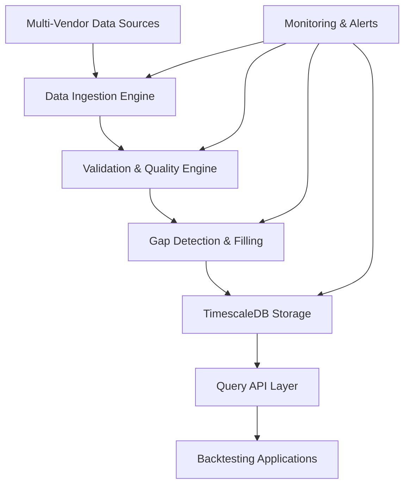

# DRD: 30-Year Daily Price History System

**Project**: Complete US Stock & ETF Daily Price Database  
**Version**: 1.0  
**Date**: August 25, 2025  
**Owner**: Data Infrastructure Team  

---

## 🏗️ **System Architecture Overview**



## 📥 **Schema Design Update (Based on Vendor Analysis)**

**Key Schema Simplification**: Analysis of vendor data (Tiingo, Polygon, EODHD) shows that all major vendors automatically handle corporate actions in their `adjusted_close` prices:

**✅ AAPL 7:1 Split Evidence (2014-06-09)**:
- Tiingo provides both `close_price` (raw) and `adj_close_price` (split/dividend adjusted)
- Raw prices: $645.57 → $93.70 (7:1 split automatically applied)  
- Adjusted prices: $20.28 → $20.60 (continuity maintained across corporate actions)
- Volume properly adjusted: 12.4M → 75.4M shares

**Schema Decision**: Remove `split_factor` and `dividend` columns as **redundant** - vendors handle this automatically in adjusted price feeds.

## 📥 **Phase 1: Historical Backfill System**

### **Multi-Vendor Data Orchestration**
```python
# Core backfill coordination
class HistoricalBackfillOrchestrator:
    def __init__(self):
        self.vendors = [PolygonAdapter(), EODHDAdapter(), AlphaVantageAdapter(), TiingoAdapter()]
        self.priority_order = ["polygon", "eodhd", "alphavantage", "tiingo"]
        
    async def backfill_symbol_range(self, symbols: List[str], 
                                   start_date: date, end_date: date):
        """Coordinate multi-vendor backfill with intelligent failover"""
```

### **Vendor-Specific Implementations**

#### **Polygon.io Adapter** (Primary Source)
```python
class PolygonBackfillAdapter:
    BASE_URL = "https://api.polygon.io/v2"
    RATE_LIMIT = 5  # requests per second
    
    async def fetch_daily_data(self, symbol: str, start: date, end: date):
        """Fetch daily bars with corporate action adjustments"""
        url = f"{self.BASE_URL}/aggs/ticker/{symbol}/range/1/day/{start}/{end}"
        # Implement exponential backoff, rate limiting, error handling
```

#### **EODHD Adapter** (Historical Depth)
```python
class EODHDBackfillAdapter:
    BASE_URL = "https://eodhd.com/api"
    RATE_LIMIT = 20  # requests per second (paid tier)
    
    async def fetch_historical_data(self, symbol: str, start: date, end: date):
        """Fetch historical daily data with excellent depth back to 1970"""
        url = f"{self.BASE_URL}/eod/{symbol}.US"
        params = {"from": start, "to": end, "period": "d", "fmt": "json"}
        # EODHD: Excellent historical depth, competitive pricing
        # Strong for ETFs and bonds, good corporate actions handling
```

#### **Alpha Vantage Adapter** (Validation Source)
```python
class AlphaVantageBackfillAdapter:
    BASE_URL = "https://www.alphavantage.co/query"
    RATE_LIMIT = 5  # requests per minute (free tier), 75/minute (premium)
    
    async def fetch_daily_adjusted(self, symbol: str):
        """Fetch full historical data with dividend/split adjustments"""
        # Alpha Vantage Assessment:
        # ✅ Pros: Reliable data quality, good free tier for testing
        # ✅ Good corporate actions handling, clean API responses
        # ❌ Cons: Strict rate limits on free tier (5/min vs 75/min premium)
        # ❌ Limited batch operations, requires individual symbol calls
        # ❌ Can be expensive for high-volume usage ($600+/month)
        # 💰 Best for: Validation/cross-checking, not primary source
```

### **Backfill Execution Strategy**

#### **Symbol Prioritization Algorithm**
```python
def calculate_backfill_priority(symbols: List[str]) -> List[str]:
    """Prioritize symbols by market cap and data availability"""
    priorities = []
    for symbol in symbols:
        market_cap = get_current_market_cap(symbol)
        data_gaps = count_existing_gaps(symbol) 
        etf_factor_weight = get_etf_importance(symbol)
        
        priority_score = (market_cap * 0.4 + 
                         (1000 - data_gaps) * 0.3 + 
                         etf_factor_weight * 0.3)
        priorities.append((symbol, priority_score))
    
    return [s for s, _ in sorted(priorities, key=lambda x: x[1], reverse=True)]
```

#### **Batch Processing Configuration**
```yaml
backfill_config:
  batch_size: 50  # symbols per batch
  concurrent_requests: 10  # per vendor
  retry_attempts: 3
  backoff_multiplier: 2
  chunk_size_days: 365  # yearly chunks for memory management
  
vendor_rate_limits:
  polygon: 5/second
  eodhd: 20/second
  alphavantage: 5/minute (free), 75/minute (premium)
  tiingo: 500/hour
```

## 🧹 **Phase 2: Data Cleaning & Quality Engine**

### **Corporate Actions Processor**
```python
class CorporateActionsProcessor:
    def __init__(self):
        self.split_detector = StockSplitDetector()
        self.dividend_processor = DividendProcessor()
        self.spinoff_handler = SpinoffHandler()
    
    def process_corporate_actions(self, symbol: str, 
                                raw_data: List[DailyPrice]) -> List[DailyPrice]:
        """Apply corporate action adjustments retroactively"""
        
        # 1. Detect stock splits (price jumps >50% with volume spike)
        splits = self.split_detector.detect_splits(raw_data)
        
        # 2. Apply split adjustments backwards
        adjusted_data = self.apply_split_adjustments(raw_data, splits)
        
        # 3. Process dividend adjustments
        final_data = self.dividend_processor.adjust_for_dividends(
            adjusted_data, symbol)
        
        return final_data
```

### **Outlier Detection & Validation**
```python
class DataQualityValidator:
    def __init__(self):
        self.price_validators = [
            PriceRangeValidator(),     # Check reasonable price bounds
            VolumeValidator(),         # Volume consistency checks  
            GapValidator(),            # Missing data detection
            VolatilityValidator(),     # Extreme price move detection
            CrossVendorValidator()     # Multi-source consistency
        ]
    
    def validate_daily_data(self, data: List[DailyPrice]) -> QualityReport:
        """Comprehensive data quality scoring"""
        quality_issues = []
        
        for validator in self.price_validators:
            issues = validator.validate(data)
            quality_issues.extend(issues)
        
        quality_score = self.calculate_quality_score(quality_issues)
        return QualityReport(score=quality_score, issues=quality_issues)
```

### **Cross-Vendor Reconciliation**
```python
class CrossVendorReconciler:
    def __init__(self):
        self.tolerance_pct = 0.1  # 0.1% price difference tolerance
        self.min_sources = 2      # Require 2+ sources for validation
    
    def reconcile_price_data(self, symbol: str, date: date) -> ReconciledPrice:
        """Compare prices across vendors and select best value"""
        
        vendor_prices = {}
        for vendor in self.vendors:
            price_data = vendor.get_daily_price(symbol, date)
            if price_data:
                vendor_prices[vendor.name] = price_data
        
        if len(vendor_prices) < self.min_sources:
            return self.handle_insufficient_sources(symbol, date)
        
        # Statistical analysis to detect outliers
        reconciled = self.statistical_reconciliation(vendor_prices)
        confidence = self.calculate_confidence(vendor_prices, reconciled)
        
        return ReconciledPrice(
            symbol=symbol, date=date, 
            price_data=reconciled,
            confidence_score=confidence,
            source_count=len(vendor_prices)
        )
```

## 🔄 **Phase 3: Forward-Fill & Maintenance System**

### **Daily Update Pipeline**
```python
class DailyUpdateOrchestrator:
    def __init__(self):
        self.update_time = time(18, 0)  # 6 PM ET
        self.lookback_days = 5          # Update last 5 days for corrections
        
    async def run_daily_update(self):
        """Execute daily EOD data update process"""
        
        # 1. Get active symbol universe
        active_symbols = await self.get_active_trading_universe()
        
        # 2. Fetch latest data from all vendors  
        update_tasks = []
        for vendor in self.vendors:
            task = vendor.fetch_recent_data(
                symbols=active_symbols,
                days_back=self.lookback_days
            )
            update_tasks.append(task)
        
        # 3. Process updates with quality validation
        raw_updates = await asyncio.gather(*update_tasks)
        validated_updates = await self.validate_and_reconcile(raw_updates)
        
        # 4. Apply updates to database
        await self.apply_database_updates(validated_updates)
        
        # 5. Generate data quality report
        await self.generate_daily_quality_report()
```

### **Gap Detection & Intelligent Filling**
```python
class GapFillEngine:
    def __init__(self):
        self.market_calendar = TradingCalendar()
        self.interpolation_strategies = {
            'linear': LinearInterpolation(),
            'carry_forward': CarryForwardFill(),
            'market_proxy': MarketProxyFill(),
            'vendor_fallback': VendorFallbackFill()
        }
    
    async def detect_and_fill_gaps(self, symbol: str) -> GapFillReport:
        """Detect missing data and apply intelligent filling strategies"""
        
        # 1. Get expected trading dates vs actual data dates
        expected_dates = self.market_calendar.get_trading_dates(
            start=date(1995, 1, 1), 
            end=date.today()
        )
        
        existing_dates = await self.get_existing_dates(symbol)
        missing_dates = set(expected_dates) - set(existing_dates)
        
        if not missing_dates:
            return GapFillReport(symbol=symbol, gaps_found=0)
        
        # 2. Categorize gaps and apply appropriate filling strategy
        filled_data = []
        for missing_date in sorted(missing_dates):
            gap_context = self.analyze_gap_context(symbol, missing_date)
            strategy = self.select_fill_strategy(gap_context)
            
            filled_price = await strategy.fill_gap(symbol, missing_date)
            if filled_price:
                filled_data.append(filled_price)
        
        # 3. Apply filled data to database with quality annotations
        await self.store_gap_filled_data(filled_data)
        
        return GapFillReport(
            symbol=symbol,
            gaps_found=len(missing_dates),
            gaps_filled=len(filled_data),
            fill_strategies_used=self.get_strategy_breakdown(filled_data)
        )
```

## 🗄️ **Database Design & Optimization**

### **TimescaleDB Schema Optimization**
```sql
-- Hypertable for time-series optimization
SELECT create_hypertable('dev_daily_prices', 'date', 
                        chunk_time_interval => INTERVAL '1 year');

-- Compression for historical data (>2 years old)
ALTER TABLE dev_daily_prices SET (
    timescaledb.compress,
    timescaledb.compress_segmentby = 'symbol',
    timescaledb.compress_orderby = 'date DESC'
);

-- Automatic compression policy
SELECT add_compression_policy('dev_daily_prices', INTERVAL '2 years');

-- Efficient indexing strategy
CREATE INDEX idx_daily_prices_symbol_date ON dev_daily_prices (symbol, date DESC);
CREATE INDEX idx_daily_prices_date ON dev_daily_prices (date DESC) WHERE date >= NOW() - INTERVAL '1 year';
CREATE INDEX idx_daily_prices_vendor ON dev_daily_prices (data_vendor, symbol);
CREATE INDEX idx_daily_prices_adjusted ON dev_daily_prices (symbol, date DESC) 
    WHERE adjusted_close IS NOT NULL;
```

### **Data Partitioning Strategy**
```sql
-- Yearly partitioning for optimal query performance
CREATE TABLE dev_daily_prices_1995 PARTITION OF dev_daily_prices 
    FOR VALUES FROM ('1995-01-01') TO ('1996-01-01');
    
-- Automated partition management
CREATE OR REPLACE FUNCTION create_yearly_partitions()
RETURNS void AS $$
DECLARE
    start_year INTEGER := 1995;
    end_year INTEGER := EXTRACT(YEAR FROM CURRENT_DATE) + 1;
    year_val INTEGER;
BEGIN
    FOR year_val IN start_year..end_year LOOP
        EXECUTE format('CREATE TABLE IF NOT EXISTS dev_daily_prices_%s PARTITION OF dev_daily_prices FOR VALUES FROM (''%s-01-01'') TO (''%s-01-01'')', 
                      year_val, year_val, year_val + 1);
    END LOOP;
END;
$$ LANGUAGE plpgsql;
```

## 📊 **Monitoring & Observability**

### **Data Quality Dashboard**
```python
class DataQualityMetrics:
    def __init__(self):
        self.metrics = {
            'data_completeness': self.calculate_completeness_rate(),
            'cross_vendor_agreement': self.calculate_agreement_rate(),
            'gap_fill_rate': self.calculate_gap_fill_success(),
            'daily_update_latency': self.calculate_update_latency(),
            'quality_score_distribution': self.get_quality_distribution()
        }
    
    async def generate_daily_report(self) -> DataQualityReport:
        """Generate comprehensive daily data quality report"""
        return DataQualityReport(
            date=date.today(),
            total_symbols=await self.count_active_symbols(),
            completeness_rate=await self.calculate_completeness_rate(),
            quality_issues=await self.detect_quality_issues(),
            vendor_health=await self.check_vendor_health(),
            storage_metrics=await self.get_storage_metrics()
        )
```

### **Alert System Configuration**
```yaml
data_quality_alerts:
  critical:
    - completeness_rate < 95%
    - vendor_downtime > 4 hours
    - daily_update_failure
    - quality_score_drop > 5%
  
  warning:
    - completeness_rate < 98%
    - cross_vendor_disagreement > 1%
    - gap_fill_failure_rate > 5%
    - query_latency_p95 > 200ms

notification_channels:
  - slack: "#data-alerts" 
  - email: "data-team@company.com"
  - pagerduty: critical alerts only
```

## 🚀 **Deployment & Operations**

### **Kubernetes Job Definitions**
```yaml
# Historical backfill job
apiVersion: batch/v1
kind: Job
metadata:
  name: historical-backfill-30year
  namespace: ats-dev
spec:
  parallelism: 5
  completions: 1
  template:
    spec:
      containers:
      - name: backfill-worker
        image: dragonflyer762/ats-genai:latest
        command: ["python", "scripts/k8s-extracted/historical_backfill_30year.py"]
        env:
        - name: BATCH_SIZE
          value: "50"
        - name: START_DATE
          value: "1995-01-01"
        - name: END_DATE  
          value: "2025-08-25"
        resources:
          requests:
            memory: "2Gi"
            cpu: "1000m"
          limits:
            memory: "4Gi"
            cpu: "2000m"
```

### **Operational Procedures**

#### **Backfill Execution Plan**
```bash
# Phase 1: Core ETF universe (immediate market factor coverage)
python scripts/run_dev.py deploy --file k8s/backfill-core-etfs-job.yaml

# Phase 2: Large-cap stocks (S&P 500 coverage) 
python scripts/run_dev.py deploy --file k8s/backfill-large-cap-job.yaml

# Phase 3: Complete universe (all stocks + remaining ETFs)
python scripts/run_dev.py deploy --file k8s/backfill-complete-universe-job.yaml

# Monitor progress
python scripts/run_dev.py logs backfill-worker
python scripts/run_dev.py query --query "SELECT COUNT(DISTINCT symbol) FROM dev_daily_prices"
```

#### **Data Quality Validation**
```bash
# Daily quality checks
python scripts/run_dev.py deploy --file k8s/daily-quality-check-job.yaml

# Cross-vendor reconciliation
python scripts/run_dev.py deploy --file k8s/cross-vendor-reconciliation-job.yaml

# Gap detection and filling
python scripts/run_dev.py deploy --file k8s/gap-detection-job.yaml
```

## 🎯 **Success Metrics & Testing**

### **Integration Test Suite**
```python
class HistoricalDataIntegrationTests:
    async def test_backfill_completeness(self):
        """Verify 30-year backfill covers expected date ranges"""
        
    async def test_corporate_actions_accuracy(self):
        """Validate stock split and dividend adjustments"""
        
    async def test_cross_vendor_consistency(self):
        """Ensure vendor data reconciliation works properly"""
        
    async def test_gap_filling_quality(self):
        """Verify intelligent gap filling produces reasonable values"""
        
    async def test_query_performance(self):
        """Validate sub-100ms query response for backtesting"""
        
    async def test_daily_update_pipeline(self):
        """End-to-end test of daily maintenance workflow"""
```

### **Performance Benchmarks**
```bash
# Query performance testing
python scripts/k8s-extracted/benchmark_30year_queries.py \
    --test-duration 300 \
    --concurrent-users 50 \
    --query-types "5year_backtest,factor_analysis,correlation_matrix"

# Storage efficiency validation  
python scripts/run_dev.py query --query "
SELECT 
    schemaname,
    tablename, 
    pg_size_pretty(pg_total_relation_size(schemaname||'.'||tablename)) as size
FROM pg_tables 
WHERE tablename LIKE 'dev_daily_prices%'
ORDER BY pg_total_relation_size(schemaname||'.'||tablename) DESC;"
```

---

## 📋 **Implementation Checklist**

### **Phase 1: Backfill (Weeks 1-6)**
- [ ] Multi-vendor adapter implementation
- [ ] Symbol universe definition and prioritization
- [ ] Batch processing orchestration
- [ ] Rate limiting and error handling
- [ ] Core ETF universe completion
- [ ] Large-cap stock coverage
- [ ] Initial data quality validation

### **Phase 2: Cleaning (Weeks 7-10)**  
- [ ] Corporate actions processor
- [ ] Outlier detection engine
- [ ] Cross-vendor reconciliation
- [ ] Quality scoring system
- [ ] Gap detection and filling
- [ ] Data validation dashboard

### **Phase 3: Forward-Fill (Weeks 11-12)**
- [ ] Daily update automation  
- [ ] Real-time monitoring system
- [ ] Alert configuration
- [ ] Performance optimization
- [ ] Documentation and runbooks
- [ ] Production deployment

**Next Steps**: Begin Phase 1 implementation with core ETF universe backfill for immediate algorithmic trading capability.