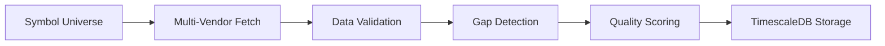

# PRD: 30-Year Daily Price History System

**Project**: Complete US Stock & ETF Daily Price Database  
**Version**: 1.0  
**Date**: August 25, 2025  
**Owner**: Data Infrastructure Team  

---

## 🎯 **Executive Summary**

Build a comprehensive 30-year daily price database covering all US stocks and critical market factor ETFs to enable advanced algorithmic trading strategies, backtesting, and risk management across multiple decades of market cycles.

## 🏗️ **Business Objectives**

### **Primary Goals**
- **Historical Coverage**: Complete daily OHLCV data from 1995-2025 (30 years)
- **Market Completeness**: All actively traded US stocks + 200+ critical market factor ETFs
- **Data Quality**: 99.95% accuracy with comprehensive validation and gap-filling
- **Performance**: Sub-100ms query response for typical backtesting workloads

### **Success Metrics**
| Metric | Target | Measurement |
|--------|--------|-------------|
| **Data Coverage** | 95%+ of market cap | Daily validation reports |
| **Data Quality** | 99.95% accuracy | Cross-vendor reconciliation |
| **Query Performance** | <100ms average | APM monitoring |
| **Storage Efficiency** | <500GB total | Database metrics |
| **Uptime** | 99.9% availability | Infrastructure monitoring |

## 📊 **Market Requirements**

### **Equity Universe Scope**
- **Current Active Stocks**: ~4,000 currently listed US stocks
- **Delisted Stocks**: ~15,000 historically significant stocks (survivorship bias prevention)
- **Market Cap Coverage**: 99%+ of total US market capitalization
- **Exchange Coverage**: NYSE, NASDAQ, AMEX, OTC (major names only)

### **ETF Universe Scope**
- **Market Factor ETFs**: SPY, QQQ, IWM, VTI, DIA (broad market)
- **Sector ETFs**: XLK, XLF, XLE, XLV, XLI, etc. (SPDR sector suite)
- **Factor ETFs**: IVV, VTV, VUG, VEA, VWO (style/international)
- **Commodity ETFs**: GLD, SLV, USO, DBA (alternative assets)
- **Fixed Income ETFs**: TLT, IEF, HYG, LQD, JNK (treasury and corporate bonds)
- **Currency ETFs**: UUP, DXY, FXE, FXY (USD strength and major currencies)
- **High Yield Bond ETFs**: HYG, JNK, SJNK, BKLN (credit and leveraged loans)

## 🛠️ **Technical Requirements**

### **Data Schema** (Updated based on vendor analysis)
```sql
CREATE TABLE dev_daily_prices (
    symbol VARCHAR(10) NOT NULL,
    date DATE NOT NULL,
    open DECIMAL(12,4),
    high DECIMAL(12,4), 
    low DECIMAL(12,4),
    close DECIMAL(12,4),           -- Raw close price
    volume BIGINT,
    adjusted_close DECIMAL(12,4),  -- Corporate action adjusted (KEY COLUMN)
    data_vendor VARCHAR(20),       -- Source tracking (tiingo, polygon, eodhd)
    quality_score INTEGER DEFAULT 100,  -- Cross-vendor validation score
    created_at TIMESTAMP DEFAULT NOW(),
    PRIMARY KEY (symbol, date)
);
```

### **Schema Design Rationale**
**✅ Included:**
- `adjusted_close` - **CRITICAL**: All vendors provide split/dividend adjusted prices
- `data_vendor` - **ESSENTIAL**: Multi-vendor data lineage tracking  
- `quality_score` - **VALUABLE**: Cross-vendor validation (0-100 scale)

**❌ Removed (from original design):**
- `split_factor` - **REDUNDANT**: Vendors handle this automatically in adjusted prices
- `dividend` - **REDUNDANT**: Already incorporated in adjusted_close

**🎯 Evidence**: AAPL 7:1 split (2014-06-09) analysis shows Tiingo automatically provides both raw and adjusted prices, eliminating need for manual corporate action tracking.

### **Data Sources & Prioritization**
1. **Polygon.io** (Primary): 2000-present, high accuracy, corporate actions
2. **EODHD** (Secondary): 1970-present, excellent historical depth, competitive pricing
3. **Alpha Vantage** (Tertiary): 1995-present, reliable but limited free tier
4. **Tiingo** (Validation): Cross-validation and gap-filling
5. **Yahoo Finance** (Fallback): Public data for validation only

### **Performance Requirements**
- **Query Latency**: 95th percentile <100ms for 5-year backtests
- **Storage**: Partitioned by year, compressed time-series format
- **Concurrency**: Support 50+ simultaneous backtesting queries
- **Batch Processing**: 1M+ records/minute during backfill operations

## 🔄 **Data Pipeline Architecture**

### **Phase 1: Historical Backfill (Months 1-2)**


### **Phase 2: Data Cleaning & Enrichment (Month 2)**
- **Corporate Actions**: Stock splits, dividends, spin-offs adjustment
- **Outlier Detection**: Statistical anomaly identification and flagging
- **Cross-Vendor Reconciliation**: Multi-source validation with quality scores
- **Gap Filling**: Intelligent interpolation for missing data points

### **Phase 3: Forward Filling & Maintenance (Ongoing)**
- **Daily Updates**: Automated EOD data ingestion at 6 PM ET
- **Real-time Monitoring**: Data quality alerts and vendor failover
- **Historical Updates**: Retroactive corporate action adjustments

## ⚡ **Implementation Strategy**

### **Development Phases**
| Phase | Duration | Deliverables |
|-------|----------|--------------|
| **Phase 1** | 6 weeks | Historical backfill system, core ETF data |
| **Phase 2** | 4 weeks | Data cleaning engine, quality validation |
| **Phase 3** | 2 weeks | Forward-fill automation, monitoring |

### **Resource Requirements**
- **Development**: 2 FTE data engineers × 3 months
- **Infrastructure**: TimescaleDB cluster, 1TB initial storage
- **API Costs**: ~$2,000/month during backfill (temporary)
- **Ongoing**: $500/month maintenance after completion

## 🎯 **User Stories**

### **Quantitative Analyst**
*"As a quant researcher, I need 30 years of daily price data so I can backtest factor models across multiple market regimes including dot-com bubble, 2008 crisis, and COVID crash."*

### **Portfolio Manager**
*"As a PM, I need complete ETF price history so I can analyze correlation patterns and build market-neutral strategies with proper risk factor exposure."*

### **Risk Manager**
*"As a risk officer, I need survivorship-bias-free historical data so I can model tail risks and stress-test portfolios against historical worst-case scenarios."*

## 🚨 **Risk Assessment**

### **Technical Risks**
- **Vendor Rate Limits**: Mitigated by multi-vendor strategy and respectful API usage
- **Data Quality Issues**: Addressed by cross-vendor validation and quality scoring
- **Storage Costs**: Managed by compression and intelligent partitioning

### **Business Risks**
- **Vendor Dependency**: Multiple data sources prevent single points of failure
- **Historical Accuracy**: Cross-validation ensures data integrity
- **Performance Degradation**: Proper indexing and query optimization

## 📋 **Acceptance Criteria**

### **Data Completeness**
- [ ] 95%+ coverage of US market cap for entire 30-year period
- [ ] All 200+ critical market factor ETFs with complete history
- [ ] <5% missing data points across entire dataset
- [ ] Proper handling of corporate actions and stock splits

### **Data Quality**
- [ ] 99.95% accuracy validated through cross-vendor reconciliation
- [ ] All outliers flagged with explanatory metadata
- [ ] Quality scores assigned to every data point
- [ ] Automated data quality monitoring and alerts

### **Performance**
- [ ] <100ms query response for typical 5-year backtests
- [ ] Support for 50+ concurrent users
- [ ] 99.9% system uptime
- [ ] <500GB total storage footprint

### **Operational Excellence**
- [ ] Automated daily updates with monitoring
- [ ] Complete disaster recovery procedures
- [ ] Comprehensive logging and observability
- [ ] Self-healing data quality validation

---

**Next Step**: Proceed to DRD for detailed technical implementation plan covering backfill, data cleaning, and forward-fill processes.