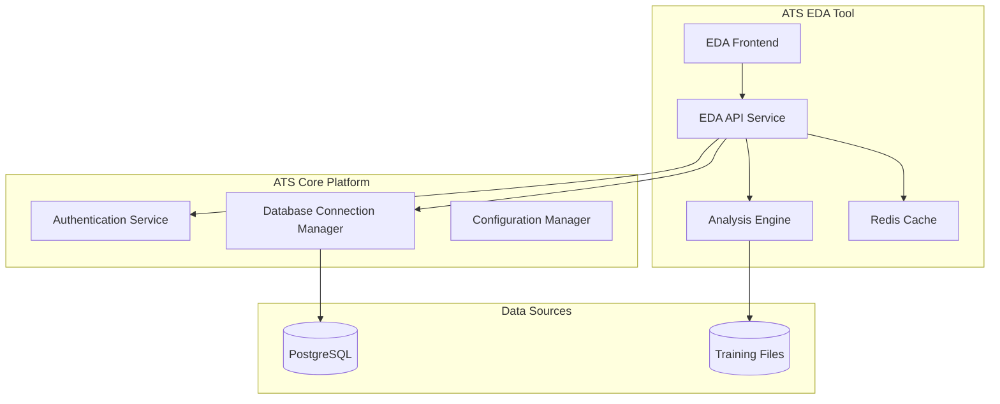
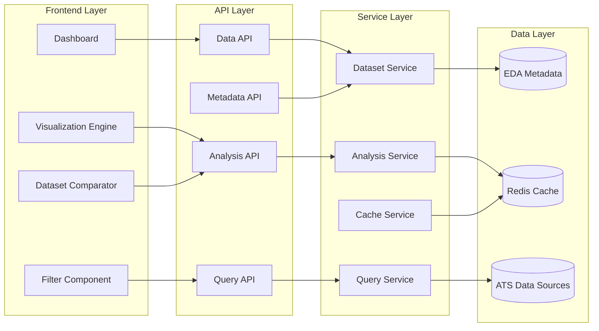
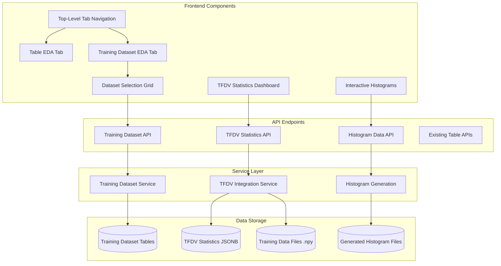

# DRD: ATS Exploratory Data Analysis (EDA) Tool

**Document Version**: 1.0  
**Date**: August 28, 2025  
**Owner**: Data Infrastructure Team  
**Status**: Technical Design  

---

## 🏗️ Technical Architecture Overview

### System Context
The ATS EDA Tool integrates seamlessly with the existing ATS platform infrastructure, leveraging the centralized database connection manager, authentication system, and containerized deployment architecture.



---

## 🎯 Technology Stack

### Backend
- **Framework**: FastAPI (consistent with ATS platform patterns)
- **Language**: Python 3.12+
- **Database ORM**: SQLAlchemy (integrates with existing connection manager)
- **Analysis Engine**: Pandas, NumPy, SciPy
- **Visualization**: Plotly, Matplotlib (server-side generation)
- **Caching**: Redis (for query results and computed statistics)

### Frontend  
- **Framework**: React 18+ with TypeScript
- **Visualization**: D3.js, Plotly.js, Chart.js
- **State Management**: Redux Toolkit
- **UI Components**: Material-UI or Ant Design
- **Build Tool**: Vite
- **Styling**: TailwindCSS

### Infrastructure
- **Containerization**: Docker (follows ATS patterns)
- **Orchestration**: Kubernetes
- **Load Balancing**: NGINX
- **Monitoring**: Prometheus + Grafana
- **Logging**: Structured logging with JSON format

### Development
- **Database Connections**: ATS Centralized Connection Manager
- **Configuration**: ATS Configuration Manager
- **Development Environment**: ATS run_dev.py integration

---

## 🗂️ System Architecture

### Component Design



### Service Responsibilities

1. **Dataset Service**: 
   - Dataset discovery and cataloging
   - Schema inference and metadata management
   - Dataset versioning and lineage tracking

2. **Analysis Service**:
   - Statistical computation engine
   - Visualization data generation
   - Comparison algorithms and metrics

3. **Query Service**:
   - SQL query generation and execution
   - Filter translation and optimization
   - Result pagination and aggregation

4. **Cache Service**:
   - Query result caching
   - Computed statistics caching
   - Session state management

5. **Training Dataset Service**:
   - Training dataset metadata management
   - Integration with training data generation pipeline
   - Dataset lifecycle tracking and versioning

6. **TFDV Integration Service**:
   - TensorFlow Data Validation statistics computation
   - Feature and label distribution analysis
   - Data quality assessment and anomaly detection
   - Histogram generation and storage management

---

## 🧠 Training Dataset EDA Architecture

### Enhanced Architecture with Training Dataset Support



### Training Dataset Data Flow

1. **Training Data Generation**: training_data_job_runner.py creates training datasets and records metadata
2. **TFDV Computation**: Automatically compute statistics for features and labels using TensorFlow Data Validation
3. **Histogram Generation**: Create interactive histogram data for visualization
4. **EDA Integration**: Display training datasets in dual-tab interface with comprehensive analysis

---

## 🗄️ Database Schema Design

### EDA Metadata Tables

```sql
-- Dataset catalog and metadata
CREATE TABLE eda_datasets (
    id UUID PRIMARY KEY DEFAULT gen_random_uuid(),
    name VARCHAR(255) NOT NULL UNIQUE,
    display_name VARCHAR(255) NOT NULL,
    description TEXT,
    dataset_type VARCHAR(50) NOT NULL, -- 'table', 'file', 'query'
    source_type VARCHAR(50) NOT NULL,  -- 'postgres', 'csv', 'parquet'
    source_config JSONB NOT NULL,      -- Connection details, file paths, etc.
    schema_info JSONB,                 -- Column metadata, types, constraints
    row_count BIGINT,
    size_bytes BIGINT,
    last_updated TIMESTAMP WITH TIME ZONE,
    created_at TIMESTAMP WITH TIME ZONE DEFAULT NOW(),
    created_by VARCHAR(100),
    tags TEXT[],
    is_active BOOLEAN DEFAULT true
);

-- Column-level metadata for datasets
CREATE TABLE eda_dataset_columns (
    id UUID PRIMARY KEY DEFAULT gen_random_uuid(),
    dataset_id UUID REFERENCES eda_datasets(id) ON DELETE CASCADE,
    column_name VARCHAR(255) NOT NULL,
    column_type VARCHAR(100) NOT NULL,
    is_nullable BOOLEAN DEFAULT true,
    unique_values BIGINT,
    null_count BIGINT,
    min_value TEXT,
    max_value TEXT,
    statistical_profile JSONB,         -- Mean, median, std, percentiles
    data_quality_score FLOAT,
    visualization_hints JSONB,         -- Suggested chart types, formatting
    created_at TIMESTAMP WITH TIME ZONE DEFAULT NOW()
);

-- Analysis sessions and saved queries
CREATE TABLE eda_analysis_sessions (
    id UUID PRIMARY KEY DEFAULT gen_random_uuid(),
    name VARCHAR(255),
    description TEXT,
    user_id VARCHAR(100) NOT NULL,
    datasets UUID[] NOT NULL,          -- Array of dataset IDs
    filters JSONB,                     -- Applied filters and conditions
    visualizations JSONB,              -- Chart configurations
    comparison_config JSONB,           -- Dataset comparison settings
    created_at TIMESTAMP WITH TIME ZONE DEFAULT NOW(),
    last_accessed TIMESTAMP WITH TIME ZONE DEFAULT NOW(),
    is_shared BOOLEAN DEFAULT false
);

-- Computed analysis results cache metadata
CREATE TABLE eda_analysis_cache (
    id UUID PRIMARY KEY DEFAULT gen_random_uuid(),
    cache_key VARCHAR(255) UNIQUE NOT NULL,
    dataset_ids UUID[] NOT NULL,
    query_hash VARCHAR(64) NOT NULL,
    result_type VARCHAR(50) NOT NULL, -- 'distribution', 'correlation', 'summary'
    computation_time_ms INTEGER,
    result_size_bytes INTEGER,
    expires_at TIMESTAMP WITH TIME ZONE,
    created_at TIMESTAMP WITH TIME ZONE DEFAULT NOW()
);

-- Data quality monitoring
CREATE TABLE eda_data_quality_checks (
    id UUID PRIMARY KEY DEFAULT gen_random_uuid(),
    dataset_id UUID REFERENCES eda_datasets(id),
    check_type VARCHAR(100) NOT NULL, -- 'completeness', 'consistency', 'validity'
    check_config JSONB NOT NULL,
    status VARCHAR(50) NOT NULL,       -- 'passed', 'failed', 'warning'
    score FLOAT,                       -- 0.0 to 1.0
    details JSONB,
    created_at TIMESTAMP WITH TIME ZONE DEFAULT NOW()
);

### Training Dataset Tables

```sql
-- Training dataset metadata with TFDV integration
CREATE TABLE dev_training_datasets (
    id SERIAL PRIMARY KEY,
    dataset_name VARCHAR(255) NOT NULL UNIQUE,
    dataset_path VARCHAR(500) NOT NULL,
    features_file VARCHAR(500) NOT NULL,
    labels_file VARCHAR(500) NOT NULL,
    metadata_file VARCHAR(500) NOT NULL,
    total_sequences INTEGER DEFAULT 0,
    sequence_length INTEGER DEFAULT 0,
    feature_count INTEGER DEFAULT 0,
    label_count INTEGER DEFAULT 0,
    symbols TEXT[] DEFAULT '{}',
    date_range_start DATE,
    date_range_end DATE,
    file_size_mb DECIMAL(10,2) DEFAULT 0.0,
    data_quality_score DECIMAL(5,4) DEFAULT 0.0000,
    feature_completeness DECIMAL(5,4) DEFAULT 0.0000,
    label_completeness DECIMAL(5,4) DEFAULT 0.0000,
    technical_indicators TEXT,
    generation_parameters JSONB DEFAULT '{}',
    training_run_id VARCHAR(255),
    
    -- TFDV Integration Fields
    tfdv_statistics JSONB DEFAULT '{}',
    tfdv_histogram_path TEXT DEFAULT '',
    tfdv_anomalies JSONB DEFAULT '{}',
    feature_distributions JSONB DEFAULT '{}',
    label_distributions JSONB DEFAULT '{}',
    
    created_at TIMESTAMP DEFAULT CURRENT_TIMESTAMP,
    updated_at TIMESTAMP DEFAULT CURRENT_TIMESTAMP
);

-- Mirror tables for integration environment
CREATE TABLE intg_training_datasets (
    id SERIAL PRIMARY KEY,
    dataset_name VARCHAR(255) NOT NULL UNIQUE,
    dataset_path VARCHAR(500) NOT NULL,
    features_file VARCHAR(500) NOT NULL,
    labels_file VARCHAR(500) NOT NULL,
    metadata_file VARCHAR(500) NOT NULL,
    total_sequences INTEGER DEFAULT 0,
    sequence_length INTEGER DEFAULT 0,
    feature_count INTEGER DEFAULT 0,
    label_count INTEGER DEFAULT 0,
    symbols TEXT[] DEFAULT '{}',
    date_range_start DATE,
    date_range_end DATE,
    file_size_mb DECIMAL(10,2) DEFAULT 0.0,
    data_quality_score DECIMAL(5,4) DEFAULT 0.0000,
    feature_completeness DECIMAL(5,4) DEFAULT 0.0000,
    label_completeness DECIMAL(5,4) DEFAULT 0.0000,
    technical_indicators TEXT,
    generation_parameters JSONB DEFAULT '{}',
    training_run_id VARCHAR(255),
    tfdv_statistics JSONB DEFAULT '{}',
    tfdv_histogram_path TEXT DEFAULT '',
    tfdv_anomalies JSONB DEFAULT '{}',
    feature_distributions JSONB DEFAULT '{}',
    label_distributions JSONB DEFAULT '{}',
    created_at TIMESTAMP DEFAULT CURRENT_TIMESTAMP,
    updated_at TIMESTAMP DEFAULT CURRENT_TIMESTAMP
);
```

-- Indexes for performance
CREATE INDEX idx_eda_datasets_name ON eda_datasets(name);
CREATE INDEX idx_eda_datasets_type ON eda_datasets(dataset_type);
CREATE INDEX idx_eda_datasets_active ON eda_datasets(is_active);
CREATE INDEX idx_eda_dataset_columns_dataset ON eda_dataset_columns(dataset_id);
CREATE INDEX idx_eda_analysis_sessions_user ON eda_analysis_sessions(user_id);
CREATE INDEX idx_eda_cache_key ON eda_analysis_cache(cache_key);
CREATE INDEX idx_eda_cache_expires ON eda_analysis_cache(expires_at);
```

---

## 🔌 API Design

### RESTful API Endpoints

#### Dataset Management
```python
# Dataset discovery and metadata
GET    /api/v1/datasets                    # List all available datasets
POST   /api/v1/datasets                    # Register new dataset
GET    /api/v1/datasets/{dataset_id}       # Get dataset details
PUT    /api/v1/datasets/{dataset_id}       # Update dataset metadata
DELETE /api/v1/datasets/{dataset_id}       # Remove dataset

# Dataset schema and profiling
GET    /api/v1/datasets/{dataset_id}/schema     # Get schema information
GET    /api/v1/datasets/{dataset_id}/profile    # Get statistical profile
POST   /api/v1/datasets/{dataset_id}/refresh    # Refresh metadata
```

#### Data Querying and Analysis
```python
# Data querying with filters
POST   /api/v1/datasets/{dataset_id}/query      # Execute filtered query
GET    /api/v1/datasets/{dataset_id}/sample     # Get sample data
POST   /api/v1/datasets/{dataset_id}/export     # Export filtered data

# Statistical analysis
POST   /api/v1/analysis/distribution            # Generate distribution charts
POST   /api/v1/analysis/correlation             # Correlation matrix
POST   /api/v1/analysis/comparison              # Compare two datasets
POST   /api/v1/analysis/summary                 # Statistical summaries

# Custom visualizations
POST   /api/v1/visualizations/ohlc              # OHLC candlestick charts
POST   /api/v1/visualizations/timeseries        # Time series analysis
POST   /api/v1/visualizations/custom            # Custom visualization logic
```

#### Session Management
```python
# Analysis sessions
GET    /api/v1/sessions                         # List user sessions
POST   /api/v1/sessions                         # Create new session
GET    /api/v1/sessions/{session_id}            # Get session details
PUT    /api/v1/sessions/{session_id}            # Update session
DELETE /api/v1/sessions/{session_id}            # Delete session
POST   /api/v1/sessions/{session_id}/share      # Share session
```

#### Training Dataset Management
```python
# Training dataset discovery and metadata
GET    /api/v1/training-datasets/                    # List all training datasets
GET    /api/v1/training-datasets/{dataset_id}        # Get training dataset details
POST   /api/v1/training-datasets/                    # Create new training dataset record
PUT    /api/v1/training-datasets/{dataset_id}        # Update training dataset metadata
DELETE /api/v1/training-datasets/{dataset_id}        # Delete training dataset record

# TFDV statistics and analysis
GET    /api/v1/training-datasets/{dataset_id}/distributions   # Get feature/label distributions
POST   /api/v1/training-datasets/{dataset_id}/tfdv-stats      # Update TFDV statistics
GET    /api/v1/training-datasets/{dataset_id}/histogram       # Get histogram data
GET    /api/v1/training-datasets/{dataset_id}/histogram?feature_name={name}  # Feature-specific histogram

# Training dataset validation
POST   /api/v1/training-datasets/{dataset_id}/validate        # Validate dataset quality
GET    /api/v1/training-datasets/{dataset_id}/anomalies       # Get TFDV anomalies
POST   /api/v1/training-datasets/{dataset_id}/compute-stats   # Recompute TFDV statistics
```

### API Response Formats

#### Dataset List Response
```json
{
  "datasets": [
    {
      "id": "550e8400-e29b-41d4-a716-446655440000",
      "name": "dev_daily_prices_tiingo_30year",
      "display_name": "Tiingo 30-Year Daily Prices",
      "description": "30 years of daily OHLCV data from Tiingo",
      "dataset_type": "table",
      "source_type": "postgres",
      "row_count": 6560000,
      "column_count": 12,
      "last_updated": "2025-08-28T14:30:00Z",
      "tags": ["prices", "daily", "tiingo", "30year"],
      "data_quality_score": 0.94
    }
  ],
  "total_count": 6,
  "page": 1,
  "page_size": 20
}
```

#### Analysis Result Response
```json
{
  "analysis_type": "distribution",
  "dataset_id": "550e8400-e29b-41d4-a716-446655440000",
  "column": "close_price",
  "filters": {
    "symbol": ["AAPL", "MSFT"],
    "date_range": ["2020-01-01", "2025-01-01"]
  },
  "results": {
    "histogram": {
      "bins": [0, 10, 20, 30, 40, 50],
      "counts": [12, 45, 123, 89, 34, 7],
      "density": [0.04, 0.14, 0.39, 0.28, 0.11, 0.02]
    },
    "statistics": {
      "mean": 28.45,
      "median": 26.80,
      "std": 12.34,
      "min": 0.50,
      "max": 49.99,
      "q25": 18.20,
      "q75": 37.60
    },
    "visualization_config": {
      "chart_type": "histogram",
      "title": "Distribution of Close Prices",
      "x_axis": "Price ($)",
      "y_axis": "Frequency"
    }
  },
  "computation_time_ms": 145,
  "cached": false,
  "generated_at": "2025-08-28T14:45:00Z"
}
```

---

## 🎨 Frontend Architecture

### Component Hierarchy

```
EDA App
├── Authentication
├── Navigation
├── Dataset Browser
│   ├── Dataset List
│   ├── Dataset Details
│   └── Schema Viewer
├── Analysis Workspace
│   ├── Filter Panel
│   ├── Visualization Panel
│   │   ├── Distribution Charts
│   │   ├── Correlation Matrix
│   │   ├── OHLC Charts
│   │   └── Custom Visualizations
│   ├── Data Table
│   └── Statistics Panel
├── Dataset Comparator
│   ├── Dataset Selector
│   ├── Comparison Charts
│   └── Difference Analysis
└── Session Management
    ├── Save/Load Sessions
    ├── Share Sessions
    └── Export Results
```

### State Management

```typescript
interface EDAState {
  // Dataset management
  datasets: {
    items: Dataset[];
    selected: string | null;
    loading: boolean;
    error: string | null;
  };
  
  // Analysis state
  analysis: {
    filters: FilterConfig;
    visualizations: VisualizationConfig[];
    results: AnalysisResult[];
    loading: boolean;
  };
  
  // Comparison state
  comparison: {
    datasets: string[];
    mode: 'side-by-side' | 'overlay';
    results: ComparisonResult | null;
  };
  
  // UI state
  ui: {
    activeTab: string;
    panelSizes: number[];
    theme: 'light' | 'dark';
  };
  
  // Session state
  session: {
    id: string | null;
    name: string;
    saved: boolean;
    shared: boolean;
  };
}
```

### Custom Visualization Framework

```typescript
interface VisualizationRule {
  id: string;
  name: string;
  description: string;
  condition: ColumnCondition;
  visualization: VisualizationConfig;
}

interface ColumnCondition {
  columnPattern: string;        // Regex pattern for column names
  dataType: string[];          // Required data types
  customLogic?: string;        // JavaScript expression
}

interface OHLCVisualizationConfig extends VisualizationConfig {
  type: 'ohlc';
  columns: {
    open: string;
    high: string;
    low: string;
    close: string;
    volume?: string;
    date: string;
  };
  candlestick: boolean;
  volume_chart: boolean;
  indicators?: TechnicalIndicator[];
}

// Example OHLC rule
const ohlcRule: VisualizationRule = {
  id: 'financial_ohlc',
  name: 'OHLC Candlestick Chart',
  description: 'Generate OHLC chart for financial price data',
  condition: {
    columnPattern: '(open|high|low|close).*price',
    dataType: ['numeric'],
    customLogic: 'hasColumns(["open_price", "high_price", "low_price", "close_price"])'
  },
  visualization: {
    type: 'ohlc',
    columns: {
      open: 'open_price',
      high: 'high_price', 
      low: 'low_price',
      close: 'close_price',
      volume: 'volume',
      date: 'trade_date'
    },
    candlestick: true,
    volume_chart: true
  }
};
```

---

## ⚡ Performance Architecture

### Caching Strategy

```python
# Multi-level caching architecture
class EDACacheManager:
    def __init__(self):
        self.redis = Redis()
        self.memory_cache = {}
        
    async def get_analysis_result(self, cache_key: str):
        # L1: Memory cache (fastest)
        if cache_key in self.memory_cache:
            return self.memory_cache[cache_key]
            
        # L2: Redis cache (fast, shared)
        result = await self.redis.get(cache_key)
        if result:
            # Populate memory cache
            self.memory_cache[cache_key] = result
            return result
            
        # L3: Database cache metadata (fallback)
        return await self.get_from_database_cache(cache_key)
        
    async def set_analysis_result(self, cache_key: str, result: dict, ttl: int = 3600):
        # Store in all cache levels
        self.memory_cache[cache_key] = result
        await self.redis.setex(cache_key, ttl, result)
        await self.store_cache_metadata(cache_key, result)
```

### Query Optimization

```python
# Smart query generation with optimization hints
class QueryOptimizer:
    def optimize_dataset_query(self, dataset: Dataset, filters: dict, limit: int = 1000):
        query = QueryBuilder(dataset.source_config['table_name'])
        
        # Add indexes hints for common patterns
        if 'symbol' in filters:
            query.add_index_hint('idx_symbol')
        if 'date_range' in filters:
            query.add_index_hint('idx_trade_date')
            
        # Optimize for analysis patterns
        if self.is_aggregation_query(filters):
            query.add_optimization('enable_hashagg', 'on')
            
        # Progressive loading for large results
        if limit > 10000:
            query.enable_streaming()
            
        return query.build()

    def generate_sampling_query(self, dataset: Dataset, sample_size: int = 10000):
        # Statistical sampling for large datasets
        if dataset.row_count > 100000:
            return f"""
                SELECT * FROM {dataset.source_config['table_name']}
                TABLESAMPLE BERNOULLI ({min(sample_size/dataset.row_count*100, 10)})
                LIMIT {sample_size}
            """
        return f"SELECT * FROM {dataset.source_config['table_name']} LIMIT {sample_size}"
```

### Progressive Data Loading

```typescript
// Frontend progressive loading strategy
class ProgressiveDataLoader {
  async loadDatasetAnalysis(datasetId: string, config: AnalysisConfig) {
    // Phase 1: Load basic metadata and sample
    const sample = await this.api.getDatasetSample(datasetId, 1000);
    this.updateUI(sample, 'sample');
    
    // Phase 2: Load statistical summary
    const summary = await this.api.getDatasetSummary(datasetId);
    this.updateUI(summary, 'summary');
    
    // Phase 3: Generate visualizations based on sample
    const quickViz = this.generateQuickVisualizations(sample);
    this.updateUI(quickViz, 'visualization');
    
    // Phase 4: Load full analysis in background
    this.loadFullAnalysis(datasetId, config);
  }
  
  private async loadFullAnalysis(datasetId: string, config: AnalysisConfig) {
    const fullAnalysis = await this.api.runFullAnalysis(datasetId, config);
    this.updateUI(fullAnalysis, 'full');
  }
}
```

---

## 🔒 Security Architecture

### Authentication Integration

```python
# Integration with existing ATS auth system
from core.auth.middleware import verify_token
from core.config.settings import get_settings

class EDAAuthMiddleware:
    def __init__(self):
        self.settings = get_settings()
        
    async def verify_dataset_access(self, user: User, dataset_id: str):
        dataset = await self.get_dataset(dataset_id)
        
        # Check role-based access
        if dataset.sensitivity_level == 'restricted':
            return user.has_role('data_scientist') or user.has_role('admin')
            
        # Check data domain access
        if dataset.tags and 'pii' in dataset.tags:
            return user.has_permission('access_pii_data')
            
        return user.has_role('analyst') or user.has_role('researcher')

# Middleware decorator for API endpoints
@require_authentication
@require_dataset_access
async def get_dataset_analysis(dataset_id: str, user: User = Depends(get_current_user)):
    return await analysis_service.analyze_dataset(dataset_id)
```

### Data Access Control

```python
# Row-level security for sensitive datasets
class DataAccessFilter:
    def apply_user_filters(self, query: str, user: User, dataset: Dataset):
        filters = []
        
        # Geographic restrictions
        if user.region == 'EU' and dataset.has_geographical_data:
            filters.append("region = 'EU'")
            
        # Time-based restrictions
        if not user.has_permission('historical_data') and dataset.has_time_column:
            cutoff_date = datetime.now() - timedelta(days=365)
            filters.append(f"trade_date >= '{cutoff_date}'")
            
        # Symbol access restrictions
        if user.role == 'limited_analyst':
            allowed_symbols = user.get_allowed_symbols()
            symbol_list = "', '".join(allowed_symbols)
            filters.append(f"symbol IN ('{symbol_list}')")
            
        if filters:
            where_clause = " AND ".join(filters)
            return self.add_where_clause(query, where_clause)
            
        return query
```

---

## 🚀 Deployment Architecture

### Container Configuration

```dockerfile
# Dockerfile for EDA API Service
FROM dragonflyer762/ats-genai:latest

WORKDIR /workspace

# Copy EDA-specific dependencies
COPY requirements-eda.txt .
RUN pip install -r requirements-eda.txt

# Copy source code
COPY src/eda ./src/eda
COPY config/eda ./config/eda

# Environment configuration
ENV PYTHONPATH=/workspace/src
ENV EDA_CONFIG_PATH=/workspace/config/eda

# Health check
HEALTHCHECK --interval=30s --timeout=10s --start-period=30s \
  CMD curl -f http://localhost:8080/health || exit 1

EXPOSE 8080
CMD ["python", "src/eda/main.py"]
```

### Kubernetes Deployment

```yaml
# k8s/eda-deployment.yaml
apiVersion: apps/v1
kind: Deployment
metadata:
  name: ats-eda-api
  namespace: ats-dev
spec:
  replicas: 2
  selector:
    matchLabels:
      app: ats-eda-api
  template:
    metadata:
      labels:
        app: ats-eda-api
    spec:
      containers:
      - name: eda-api
        image: dragonflyer762/ats-genai:eda-latest
        ports:
        - containerPort: 8080
        env:
        - name: DB_HOST
          value: "postgres"
        - name: DB_PORT
          value: "5432"
        - name: REDIS_HOST
          value: "redis"
        resources:
          requests:
            memory: "512Mi"
            cpu: "200m"
          limits:
            memory: "2Gi"
            cpu: "1000m"
        livenessProbe:
          httpGet:
            path: /health
            port: 8080
          initialDelaySeconds: 30
          periodSeconds: 10

---
apiVersion: v1
kind: Service
metadata:
  name: ats-eda-api-service
  namespace: ats-dev
spec:
  selector:
    app: ats-eda-api
  ports:
  - port: 8080
    targetPort: 8080
    nodePort: 30080
  type: NodePort
```

### Development Integration

```python
# Integration with ATS run_dev.py system
# Add to scripts/run_dev.py services configuration

services = {
    # ... existing services ...
    "eda": {
        "image": "dragonflyer762/ats-genai:latest",
        "port": "3001:8080",
        "command": "python src/eda/main.py",
        "env": {
            "DB_HOST": "postgres",
            "DB_PORT": "5432",
            "REDIS_HOST": "redis",
            "EDA_LOG_LEVEL": "DEBUG"
        }
    },
    "redis": {
        "image": "redis:7-alpine",
        "port": "6379:6379",
        "command": "redis-server --appendonly yes"
    }
}

# Usage: python scripts/run_dev.py start --service eda
```

---

## 📈 Implementation Phases

### Phase 1: Foundation (Weeks 1-4)

#### Week 1-2: Core Infrastructure
- Set up project structure and development environment
- Implement dataset discovery service for PostgreSQL tables
- Create basic metadata schema and API endpoints
- Integrate with existing ATS authentication system

#### Week 3-4: Basic Visualization
- Build React frontend with dataset browser
- Implement basic statistical analysis (mean, median, std)
- Create simple distribution charts (histograms, box plots)
- Add basic filtering capabilities

**Deliverables**:
- Working dataset catalog for vendor tables
- Basic distribution visualizations
- Simple data browser with filtering

### Phase 2: Advanced Analytics (Weeks 5-8)

#### Week 5-6: Financial Visualizations
- Implement OHLC candlestick chart generation
- Add time series analysis capabilities
- Create correlation matrix visualizations
- Build custom visualization rule engine

#### Week 7-8: Dataset Comparison
- Implement side-by-side dataset comparison
- Add statistical significance testing
- Create difference highlighting and anomaly detection
- Build comparison report generation

**Deliverables**:
- OHLC charts for price data
- Dataset comparison functionality
- Custom visualization rules for financial data

### Phase 3: Intelligence and Automation (Weeks 9-12)

#### Week 9-10: Data Quality Scoring
- Implement automated data quality assessment
- Add anomaly detection algorithms
- Create data completeness analysis
- Build quality scoring dashboard

#### Week 11-12: Operational Integration
- Add real-time data freshness monitoring
- Implement coverage gap analysis
- Create operational health dashboards
- Build alerting for data quality issues

**Deliverables**:
- Automated data quality scoring
- Operational monitoring integration
- Data health dashboards

### Phase 4: Scale and Polish (Weeks 13-16)

#### Week 13-14: Performance Optimization
- Implement progressive data loading
- Add advanced caching strategies
- Optimize query performance
- Scale testing with full datasets

#### Week 15-16: User Experience
- Polish UI/UX based on user feedback
- Add mobile responsiveness
- Implement session sharing and collaboration
- Create comprehensive documentation

**Deliverables**:
- Production-ready performance
- Polished user interface
- Complete documentation and training materials

---

## 🔍 Technical Considerations

### Data Privacy and Compliance
- Implement row-level security for sensitive datasets
- Add audit logging for all data access
- Support data anonymization for sharing
- GDPR compliance for EU user data

### Scalability Patterns
- Horizontal scaling via container orchestration
- Database connection pooling and optimization
- Caching strategies for frequently accessed data
- Progressive loading for large datasets

### Error Handling and Resilience
- Graceful degradation when services unavailable
- Comprehensive error logging and monitoring
- Automatic retry mechanisms for transient failures
- Circuit breaker patterns for external dependencies

### Testing Strategy
- Unit tests for all analysis algorithms
- Integration tests for API endpoints
- Performance tests for large dataset scenarios
- User acceptance testing with real datasets

---

## 📊 Success Metrics and Monitoring

### Technical Metrics
- **Response Time**: <3 seconds for standard visualizations
- **Throughput**: Support 100 concurrent analysis requests
- **Availability**: 99.9% uptime for core functionality
- **Cache Hit Rate**: >80% for repeated analysis requests

### Business Metrics
- **User Adoption**: 90% of data team using tool within 3 months
- **Time Savings**: 75% reduction in dataset exploration time
- **Data Quality**: 95% automated detection of quality issues
- **Research Velocity**: 50% faster hypothesis testing

### Monitoring and Alerting
```python
# Prometheus metrics collection
from prometheus_client import Counter, Histogram, Gauge

# API metrics
api_requests = Counter('eda_api_requests_total', 'Total API requests', ['endpoint', 'method'])
api_duration = Histogram('eda_api_duration_seconds', 'API request duration')
analysis_errors = Counter('eda_analysis_errors_total', 'Analysis errors', ['type'])

# Business metrics  
active_users = Gauge('eda_active_users', 'Number of active users')
datasets_analyzed = Counter('eda_datasets_analyzed_total', 'Total datasets analyzed')
cache_hit_rate = Gauge('eda_cache_hit_rate', 'Cache hit rate percentage')
```

---

**This DRD provides the comprehensive technical foundation for building a world-class EDA tool that seamlessly integrates with the ATS platform architecture and scales to meet the demanding requirements of financial data analysis.**