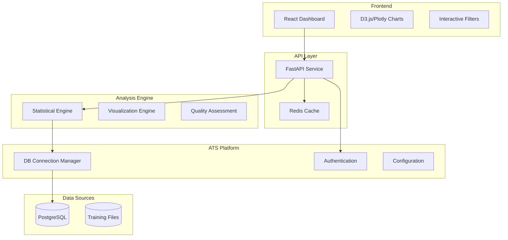

# ATS Exploratory Data Analysis (EDA) Tool

**A comprehensive data exploration and visualization platform for ATS financial datasets**

---

## 📊 Project Overview

The ATS EDA Tool provides deep insights into financial datasets through interactive visualizations, statistical analysis, and data quality assessment. It enables data scientists, quant researchers, and platform engineers to understand data patterns, validate datasets, and accelerate research workflows.

### Key Capabilities
- **Dataset Exploration**: Interactive browsing of database tables and training datasets
- **Statistical Analysis**: Distribution analysis, correlation matrices, outlier detection
- **Financial Visualizations**: OHLC candlestick charts, time series analysis
- **Dataset Comparison**: Side-by-side analysis of vendor data quality and coverage
- **Custom Logic**: Configurable visualization rules based on data types
- **Data Quality Monitoring**: Automated quality scoring and anomaly detection

---

## 🎯 Quick Start

### For Stakeholders
- **[📋 PRD - Product Requirements](PRD_ATS_EDA_Tool.md)** - Business requirements and user stories
- **[🏗️ DRD - Design Requirements](DRD_ATS_EDA_Tool.md)** - Technical architecture and design
- **[🚀 Implementation Plan](IMPLEMENTATION_PLAN.md)** - Development roadmap and code examples

### For Developers
```bash
# 1. Review technical requirements
cat DRD_ATS_EDA_Tool.md

# 2. Follow implementation plan
cat IMPLEMENTATION_PLAN.md

# 3. Set up development environment
python scripts/run_dev.py start --service eda
```

---

## 📈 Starting Datasets

The EDA tool begins with core ATS financial datasets:

### Daily Price Tables
- **Tiingo**: 6.56M records, 2,355 symbols (30-year coverage)  
- **Polygon**: 666K records, 849 symbols (high-quality data)
- **EODHD**: 728K records, 268 symbols (supplementary coverage)

### Instrument Tables  
- **Tiingo Instruments**: 16,811 total (12,118 active)
- **Polygon Instruments**: 11,598 active instruments
- **EODHD Instruments**: 7,613 populated

### Example Use Cases
1. **Vendor Coverage Analysis**: Compare data availability across Tiingo, Polygon, EODHD
2. **Data Quality Assessment**: Identify missing data, outliers, inconsistencies  
3. **OHLC Pattern Analysis**: Generate candlestick charts for price sequence data
4. **ML Feature Validation**: Statistical profiling for model training datasets

---

## 🏗️ Technical Architecture



### Integration Points
- **Database**: Uses ATS centralized connection manager
- **Authentication**: Integrates with existing ATS auth system
- **Development**: Follows ATS Docker-based development patterns
- **Deployment**: Kubernetes deployment via ATS infrastructure

---

## 🚀 Implementation Timeline

### Phase 1: Foundation (Weeks 1-4) - **MVP**
- ✅ Dataset discovery for vendor tables
- ✅ Basic web interface and data browser
- ✅ Simple distribution visualizations
- ✅ Integration with ATS development environment

### Phase 2: Advanced Analytics (Weeks 5-8) - **Alpha**
- 📊 OHLC candlestick charts for financial data
- 🔍 Dataset comparison and statistical testing
- 🎯 Custom visualization rules engine
- ⚡ Caching and performance optimization

### Phase 3: Intelligence (Weeks 9-12) - **Beta**
- 🎯 Automated data quality scoring
- 📈 Operational monitoring integration
- 🔄 Session management and collaboration
- 🚨 Anomaly detection and alerting

### Phase 4: Production (Weeks 13-16) - **Release**
- 🚀 Full performance optimization
- 🔒 Security review and testing
- 📚 Documentation and user training
- 📊 Production deployment and monitoring

---

## 📋 Key Features

### 🔍 **Dataset Management**
- Automatic discovery of database tables
- Schema inference and metadata extraction
- Dataset cataloging with searchable tags
- Version tracking and lineage

### 📊 **Visualizations**
- Distribution histograms and box plots
- Correlation heatmaps and scatter plots
- Time series charts with zoom and pan
- **OHLC candlestick charts** for price data
- Missing data pattern visualization

### 🎯 **Custom Logic Example: OHLC Charts**
```typescript
// Automatically detect OHLC data patterns
interface OHLCRule {
  condition: {
    columns: ['open_price', 'high_price', 'low_price', 'close_price'],
    dataType: 'numeric'
  },
  visualization: {
    type: 'candlestick',
    dateColumn: 'trade_date',
    volumeColumn?: 'volume'
  }
}

// Result: Interactive candlestick chart with volume overlay
```

### 🔄 **Dataset Comparison**
- Side-by-side distribution comparison
- Statistical significance testing (KS test, t-test)
- Vendor coverage matrices
- Data quality metric comparison

### 🎯 **Data Quality Features**
- Completeness analysis (null value patterns)
- Consistency validation across vendors
- Outlier detection and flagging
- Automated quality scoring (0-1 scale)

---

## 🎖️ Success Metrics

### Business Impact
- **75% reduction** in dataset exploration time
- **50% faster** feature engineering and validation
- **95% automated** data quality issue detection
- **100% visibility** into vendor data coverage

### Technical Performance
- **<3 second** response time for visualizations
- **10M+ rows** dataset support
- **100 concurrent users** capacity
- **99.9% uptime** availability

---

## 🤝 Team and Ownership

### Primary Stakeholders
- **Data Infrastructure Team**: Technical implementation and maintenance
- **Quantitative Research Team**: Primary users and requirements feedback
- **Platform Engineering**: Infrastructure and deployment support
- **Data Science Team**: Analysis workflows and model validation

### Key Roles
- **Product Owner**: Data Infrastructure Lead
- **Technical Lead**: Senior Full-Stack Engineer
- **Frontend Developer**: React/TypeScript specialist  
- **Backend Developer**: Python/FastAPI expert
- **Data Engineer**: Database optimization and ETL

---

## 📚 Documentation Structure

```
docs/projects/ats-eda-tool/
├── README.md                    # This overview document
├── PRD_ATS_EDA_Tool.md         # Product Requirements Document
├── DRD_ATS_EDA_Tool.md         # Design Requirements Document  
├── IMPLEMENTATION_PLAN.md       # Development roadmap
├── API_SPECIFICATION.md         # API documentation (coming soon)
├── USER_GUIDE.md               # End-user documentation (coming soon)
└── DEPLOYMENT_GUIDE.md         # Operations guide (coming soon)
```

---

## 🚀 Getting Started

### For Business Stakeholders
1. **Review [PRD](PRD_ATS_EDA_Tool.md)** for business requirements and ROI
2. **Approve scope and timeline** based on implementation plan
3. **Provide user feedback** during development phases

### For Technical Team
1. **Study [DRD](DRD_ATS_EDA_Tool.md)** for technical architecture
2. **Follow [Implementation Plan](IMPLEMENTATION_PLAN.md)** for development
3. **Set up development environment** using existing ATS patterns

### For End Users
1. **Participate in user testing** during alpha/beta phases
2. **Provide feedback** on visualization requirements
3. **Prepare for training** on final tool capabilities

---

## 🎯 Why This Matters

> **"Data without insight is just noise. The ATS EDA Tool transforms our 7.95M+ financial records into actionable intelligence that drives better trading decisions and model performance."**

### Current Pain Points Solved
- ❌ **40+ hours/week** spent on manual data exploration
- ❌ **Inconsistent analysis** tools across the team
- ❌ **Unknown data quality** issues discovered too late
- ❌ **Difficult vendor comparison** for data sourcing decisions

### Future State Enabled  
- ✅ **Minutes not hours** for dataset understanding
- ✅ **Consistent analysis** workflows and visualizations
- ✅ **Proactive quality** monitoring and alerting
- ✅ **Data-driven vendor** selection and optimization

---

**The ATS EDA Tool represents a significant step forward in the platform's data intelligence capabilities, enabling the team to make better decisions faster with deeper dataset understanding.**

🚀 **Ready to build the future of financial data exploration!**